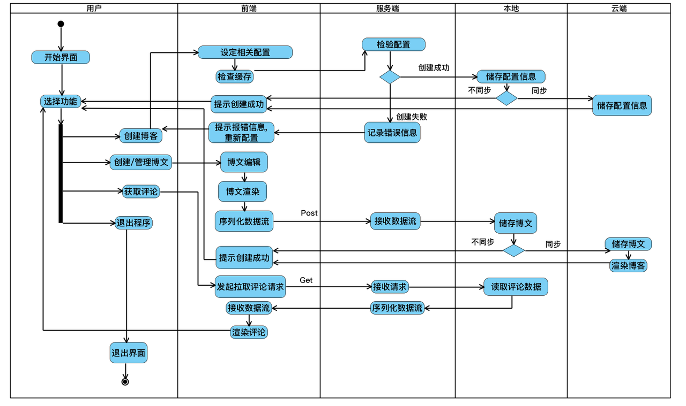
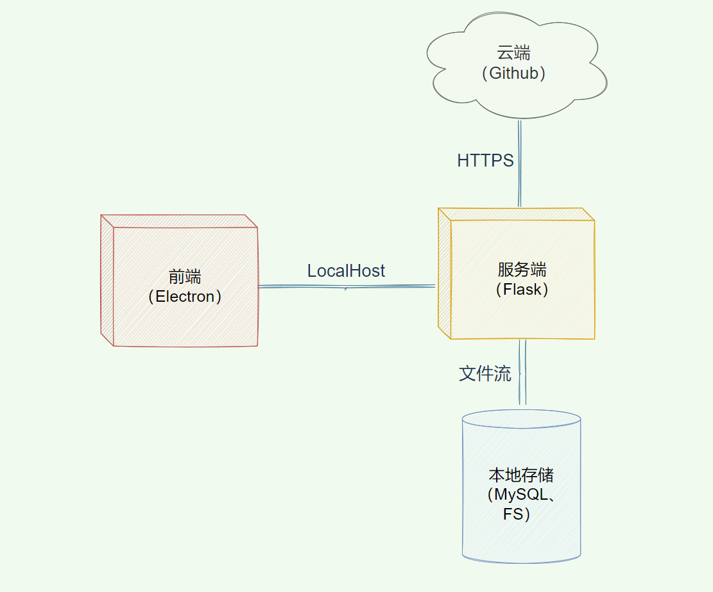

# Applying UML for SRS

# 主要业务逻辑

程序应具有一键服务器部署博客的功能，能够根据用户选择的主题和博客框架部署对应的博客，并能够管理用户编写的博文，提供文件储存、备份、修改、删除等基本功能，并对博文进行标签选择，类别归档，以及评论管理。未来还将引入社区功能，引入插件模式，可以自定义化扩展程序功能。

#### 1. 一键部署博客过程 

- 检查部署机子的操作系统，判断是Windows还是Linux还是MacOS，遇到MacOS则报告相关错误并停止，否则继续。
- 检查系统的环境是否合适，检查是否装有选择储存方式的数据库（或Git），部署博客必须的npm或yarn，并检查网络是否通畅。如未发现装有对应数据库或npm或yarn，则软件能自动从官方网站的下载链接下载软件的最新版本并自动安装。如网络不通畅则报告相关错误并停止。否则继续。
- 初始化数据库表，并在用户选择的部署文件系统的路径初始化目录。运用npm或yarn部署博客相关的网页文件，并配置用户自定义的自我介绍。
- 初始化网页服务器，监听特定端口以处理外部网页访问请求。
- 打开用户默认浏览器，让用户预览部署结果。

#### 2. 博文编写过程 

- 保存博客文本文件于文件系统中。
- 更新数据库博文表。
- 更新博客网页文本目录，生成新的网页，包含该博文。

#### 3. 博文修改过程 

- 更新博客文本文件于文件系统中。
- 更新数据库博文表。
- 更新博客网页文本目录，包含该博文。

#### 4. 博文删除过程 

- 再三提醒用户是否确认删除该博文，并告知该操作不可逆。
- 如用户选择否，则停止删除操作，否则在文件系统中删除博文文本，并更新数据库博文表，移除该博文的信息。
- 更新博客网页文本目录，移除该博文。

#### 5. 博客自动备份过程 

- 每隔30s，将用户编写的博文文本保存在文件系统中，防止断电丢失等异常情况发生带来的不好体验。

#### 6. 评论删除过程 

- 再三提醒用户是否确认删除该评论，并告知该操作不可逆。
- 更新数据库评论表，删除该评论

# UML 1（用例图）

用例图捕捉了模拟系统中的动态行为，并且描述了用户、需求以及系统功能单元之间的关系。

用例图展示了一个外部用户能够观察到的系统功能模型图。

用例图由主角，用例和它们之间的关系组成。

对于用户来说，他可以使用的功能为一键部署博客，添加博文，修改博文，删除博文，删除评论的功能，软件代为用户向服务器交互，更新博客数据。

# UML 2（类图）

类图（Class Diagram）是面向对象系统建模中最常用和最重要的图，是定义其它图的基础。

类图主要是用来显示系统中的类、接口以及它们之间的静态结构和关系的一种静态模型。

类图不仅用于可视化描述和记录系统的不同方面，也为构建可执行代码的软件应用程序。

对于NBlog来说，其类共有：前端界面UI和后端Backend。

用户通过UI进行操作，其行为交由后端的配置类、博客管理类、评论管理类等进行执行。

# UML 3（对象图）

UML 对象图和类图一样反映系统的静态过程，但它是从实际的或原型化的情景来表达的。

UML 对象图显示某时刻对象和对象之间的关系。一个UML对象图可看成一个类图的特殊用例，实例和类可在其中显示。

UML 对象图是类图的实例，几乎使用与类图完全相同的标识。

由于对象存在生命周期，因此UML对象图只能在系统某一时间段存在。

对于NBlog来说，大的部分，前端和后端都是NBlog的一部分，而用户和服务器是独立于该软件，与该软件交互的。

# UML 4（顺序图）

顺序图，又名时序图，序列图，循序图，是一种UML交互图，描述了对象之间发送消息的时间顺序显示多个对象之间的协作。参考NBlog的一次工作逻辑，我们设计对应的顺序图如下：

用户使用NBlog服务涉及的主要流程逻辑包括：

1. 博客创建
   1. 前端向服务端发送Post请求
   2. 服务端将博客信息存储到本地
   3. 云端init仓库
2. 前端提示用户创建博文
3. 用户创建博文
   1. 前端向服务端发送Post请求
   2. 服务端将博文信息存储到本地
   3. 云端同步仓库
4. 前端提示用户创建评论
5. 用户创建评论
   1. 前端向服务端发送Post请求
   2. 服务端将评论信息存储到本地
   3. 云端同步仓库
6. 用户请求退出
7. 程序退出

# UML 5（协作图）

协作图是动态图的另一种表现形式，强调参加交互的各对象结构的信息。协作图是一种类图，包含类元角色和关联角色，而不仅仅是类元和关联。协作图强调参加交互的各对象的组织。

从上图可以看到，当用户发起创建博客请求后，首先由前端解析请求，解析成功后向服务端传递RESTFUL请求，服务端收到请求并解析后，一方面向本地持久化写入信息，另一方面与云端Github仓库同步。

由此可以看出，服务端和前端解析用户的操作和请求。本地和云端将博文、评论等信息持久化。

# UML 6（活动图）

UML活动图是一种表述过程基理、业务过程以及工作流的技术。它可以用来对业务过程、工作流建模，也可以对用例实现甚至是程序实现来建模。

UML活动图基本上是代表流程形成一个活动到另一个活动的流程图。活动可以被描述为一个系统的操作。

用户进入程序后， 软件呈现开始界面欢迎用户。如果用户没有初始化过自己的博客， 那么软件会提示用户进行相应的初始化操作。 具体的， 程序会引导用户一步一步设定好相应的配置，在检查无误后把配置信息储存在本地中。 如果用户有相应要求， 程序也会将配置信息同步到云端。 之后前端会提示博客创建成功的信息。 

在用户初始化好自己的博客之后， 便可以进行博文的创建和管理。用户创建某篇博客或者选择某篇之前的博客， 程序将在前端界面进行渲染。 用户可以在前端界面进行相应的编辑操作，并进行博文的发表。 博文发表时， 前端会将博文数据进行序列化为数据流，以 Post 请求发送到服务端。 服务段接收数据流后解析数据流， 然后将博文数据储存到本地。 一般来说，博文数据也会被同步到云端中进行渲染，实时更新用户的网站。 之后前端会提示博客创建/更新成功的信息。

用户也可以选择拉取评论，通过前端请求服务段拉取评论数据， 并最后渲染到前端界面， 方便用户进行查看。 

最后用户可以选择退出程序， 将进入到退出界面并退出。  

# UML 7（状态图）

UML状态图是图表本身的名称，主要用于描述对象具有的各种状态、状态之间的转换过程以及触发状态转换的各种事件和条件。

UML状态图描述了一个状态机，可以被定义为一台机器，它定义了一个对象，这些状态控制外部或内部事件的不同状态。

对于NBlog来说，核心状态就是提供服务的服务端状态，处于正常状态，检测到异常后非法操作后就会进入异常状态。正常状态下分别执行博客框架创建删除、博文创建删除等操作，当遇到非法操作时即抛出异常并进入进行错误恢复或退出。

# UML 8（组件图）

UML 组件图又称为构件图，他描述的是在软件系统中遵从并实现一组接口的物理的、可替换的软件模块。

本软件的组件主要包括前端界面，日志系统，插件系统，数据库系统， 游客， 评论管理系统， 用户， 博文管理系统，软件配置系统，服务器和文本编辑渲染系统。 

其中前端界面和文本编辑渲染系统总共构成了前端， 日志系统， 评论管理系统， 博文管理系统和软件配置系统共同构成了后端。 用户在本地进行操作， 服务器为云端，游客由因特网进入访问博客网站并发表评论。

# UML 9（部署图）

部署图描述的是系统运行时的结构，展示了硬件的配置及其软件如何部署到网络结构中。

以上NBlog系统的部署图描绘了系统各部分的运行资源安排，主要包括四部分资源：

- 前端（Electron）
- 服务端（Flask）
- 本地存储（MySQL、FS）
- 云端（Github Repo）

资源间关系主要有三类：

- 前端与服务端之间通过本地LocalHost连通
- 服务端与云端通过HTTPS连通
- 服务端与本地存储通过文件流连通

# UML 10（数据流图）

数据流图描述了NBlog项目从UI、前端、服务端到本地及云端的数据随各操作或方法的流动情况，大致可分为博客框架系统、博文系统和评论系统三大部分。
