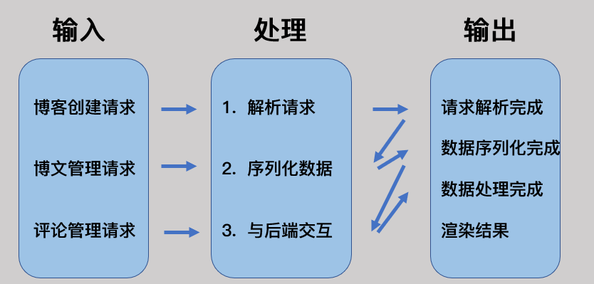

# Detailed Design Specification

## 1. 引言

### 1.1 编写目的

本概要设计文档主要用来指导NBlog的详细设计工作，为详细设计提供统一的参照标准，其中包括系统的总体设计、内外部接口、系统架构、编程模型以及其他各种主要问题的解决方案。

预期读者：NBlog开发维护者、项目审核者

### 1.2 背景

对于想要成为一个个性化的博主的人来说，想要拥有自己的博客还是有一定上手难度的。如果使用csdn或者博客园等网站进行博客开发，通常会为其广告所困扰，且由于数据全部上传存在一定的隐私泄露问题。如果使用自己服务器搭建博客，又可能因为不熟悉命令行或者看不懂代码出现bug而使得小白崩溃，觉得创建以及维护自己博客是一件极其痛苦的事情。

本产品名称为NBlog, 意在帮助小白搭建个人博客， 对于小白极度友好，将实现一键搭建博客的功能，实现自己的个性化博客搭建。不同于花里胡哨的博客网站，本软件完全基于本地环境不进行数据的上传，强有力的保护了用户的隐私。另外，本软件可以开源并鼓励开发者社区开发相关插件，将建立一个良好的开发生态。

本产品技术上的运行支持平台为 Windows, 博客搭建工具为 Hexo & Hugo & Vuepress, 前端界面由 electron 搭建。本次项目开发维护人员为Lanly, ztl, hhy。

### 1.3 定义

**用户：** 使用NBlog搭建博客并管理博客的用户群体

**博客框架：** 用户所选用的博客主体框架，如Hexo、Hugo

**博文：** 用户创建、编辑并管理的博文文本及元信息

**评论：** 第三者对用户博文添加的评论文本及元信息

**云端仓库** ：持久化于云端的存放博客的仓库，如Github

**用户帐号：** 在应用信息系统中设置与保存、用于授予用户合法登陆和使用应用信息系统等权限的用户信息，包括用户名、密码以及用户真实姓名、单位、联系方式等基本信息内容。

### 1.4 参考资料

《NBlog开题报告》

《NBlog可行性分析报告》

《NBlog需求规格说明书》

《NBlog概要设计说明书》

## 2. 程序系统的结构

## 3. 前端模块设计说明

### 3.1 程序描述

本程序旨在渲染软件界面，可视化界面和接收用户的输入。旨在降低用户的使用门槛，减少学习成本，从而更加专注于博客的部署以及博文的编写和更新。

#### 3.1.1 目的意义

前端模块主要负责：捕获用户的信号输入，进行相应的解析操作。然后根据相应的逻辑与后端模块进行交互，即通过相应端口向将后端发送相应请求。另外，前端需要渲染出精美好用的UI界面，方便用户进行博客创建和撰写等操作。

#### 3.1.2 程序特点

前端模块的主要程序特点如下：

* 具有发送http请求的模块， 同后端模块进行交互。
* 采用最新框架渲染精美好用的UI界面，方便用户进行操作。
* 各个界面之间的逻辑合理耦合，采用 electron 之间的进程间通信
* 前后端分离，处理方式为并发处理

### 3.2 功能

### 3.3 性能

* 精度要求：
  * 渲染模块粒度保持在http的dom元素级别
* 灵活性：平台兼容性方面，考虑到面向小白，因此主要考虑Windows系统上的稳定性，进一步可考虑Linux、Mac操作系统上的跨平台
* 时间特性：对于每一次用户行为，响应渲染速度应保持在100毫秒级别

### 3.4 输入项

| 名称          | 标识      | 数据类型 | 有效范围     | 输入方式   | 数量或频度 | 输入媒体 | 来源 | 安全条件 |
| --------------- | ----------- | ---------- | -------------- | ------------ | ------------ | ---------- | ------ | ---------- |
| 部署博客的ip  | IP        | 字符串   | ip的有效范围 | 文本框输入 | 1          | 键盘     | 用户 | 保密     |
| 博文          | blog      | 结构体   | 有效博文结构 | 文本框输入 | 若干       | 鼠标     | 用户 | 明文     |
| 评论          | comment   | 结构体   | 有效评论结构 | 文本框输入 | 若干       | 键盘     | 用户 | 明文     |
| 用户信息      | User info | 结构体   | 有效用户结构 | http       | 1          | 用户     | 用户 | 明文     |

### 3.5 输出项

| 名称          | 标识       | 数据类型 | 有效范围         | 输出方式 | 数量或频度 | 输出媒体 | 说明               | 安全条件 |
| --------------- | ------------ | ---------- | ------------------ | ---------- | ------------ | ---------- | -------------------- | ---------- |
| 部署博客的ip  | IP         | 字符串   | ip的有效范围     | 前端渲染 | 1          | UI 界面  | 通知用户信息       | 保密     |
| 博文列表      | Blog list  | list     | 有效博文列表结构 | 前端渲染 | 频繁       | 前端     | 用户编写的博文列表 | 明文     |
| 博文          | blog       | 结构体   | 有效博文结构     | 前端渲染 | 若干       | UI 界面  | 某篇博文的具体信息 | 明文     |
| 评论          | comment    | 结构体   | 有效评论结构     | 前端渲染 | 若干       | UI 界面  | 某篇博文的若干评论 | 明文     |
| 用户信息      | User info  | 结构体   | 有效用户结构     | 前端渲染 | 1          | UI 界面  | 用户的信息         | 明文     |

### 3.6 算法

前端模块服务涉及的主要流程逻辑包括：

1. 博客创建
   1. 前端读取用户输入配置信息
   2. 渲染预览界面
   3. 发送http请求将配置数据传输给后端模块
2. 用户创建博文
   1. 渲染博文效果
   2. 将博文数据序列化后发送到后端模块
3. 用户创建评论
   1. 渲染评论效果
   2. 将评论数据序列化后发送到后端模块
4. 用户请求退出
   1. 向后端模块发送退出请求
5. 程序退出

### 3.7 流程逻辑

### 3.8 接口

### 3.9 存储分配

前端模块并不进行实际信息的存储， 中间处理的数据都会传递到后端模块进行相应的存储管理。但是前端模块会对于用户的每一个操作记录相应的日志，因而只需要存储相应操作的日志信息即可。

在前端存储根目录下进行具体划分：

* `LOG/`：该子文件夹下存放日志数据

### 3.10 注释设计

前端代码注释遵循 React 注释规则。

* 加在模块首部的注释：阐明本模块`author`、`description`、`param`、`return`等重要属性
* 加在各分支点处的注释：阐明分支处详细逻辑
* 对各变量的功能，范围，缺省条件等所加的注释：对变量属性、作用进行简单阐述
* 对使用的逻辑所加的注释等等：阐明该部分代码用途及具体逻辑。

### 3.11 限制条件

* 时间限制：为了给用户更好的响应体验，最大响应时间定为3s，最大重试次数为5次
* 空间限制：为防止存储占用过多，限制用户博文长度最大为10MB、评论长度最大为3MB。当日志文件超过50MB时自动删除
* 用户权限限制：在非特权用户下进行

### 3.12 测试计划

| 技术要求 | 输入数据                         | 预期结果                         | 进度安排      | 人员职责 | 设备条件驱动程序和桩模块 |
| ---------- | ---------------------------------- | ---------------------------------- | --------------- | ---------- | -------------------------- |
| 单元测试 | 部署ip                           | 后端接收到部署请求和ip           | 2022.05.23前  | Lanly     | 监听端口的后端           |
| 单元测试 | 博文编辑                         | 后端接收到保存请求和最新博文数据 | 2022.05.23前  | Lanly     | 监听端口的后端           |
| 单元测试 | 用户点击博文一览                 | 后端接收到请求博文列表请求       | 2022.05.23前  | Lanly     | 监听端口的后端           |
| 单元测试 | 用户点击某篇博文                 | 后端接收到请求具体博文内容的请求 | 2022.05.23前  | ztl   | 监听端口的后端           |
| 单元测试 | 用户删除某篇博文                 | 后端接收到删除某篇博文的请求     | 2022.05.23前  | ztl   | 监听端口的后端           |
| 单元测试 | 获取用户信息                     | 后端接收到请求用户信息的请求     | 2022.05.23前  | ztl   | 监听端口的后端           |
| 单元测试 | 更新用户信息                     | 后端接收到更新用户信息的请求     | 2022.05.23前  | ztl   | 监听端口的后端           |
| 集成测试 | 小白部署编写更新博文的一系列行为 | 后端能依次正确接收到对应请求     | 2022.05.25前  | hhy   | 监听端口的后端           |

### 3.13 尚未解决的问题

1. UI设计问题
2. 社区生态问题
3. 推广宣传问题
4. 多语言多平台支持问题

## 4. 后端模块设计说明

### 4.1 程序描述

该程序用于与操作系统、文件系统、网络的交互，处理用户数据。旨在提高程序的性能，同时兼具拓展性。因为Nodejs是单线程环境，其一方面又担负着前端渲染工作，故将复杂的文件操作分离出来，用具有良好并发、系统兼容良好、高效的go语言编写。

#### 4.1.1 目的意义

后端模块主要负责：首先对前端传来的HTTP请求进行解析，将输入内容反序列化后确定各参数变量的具体值。解析得到各参数后进行博客、博文、评论的增删改查逻辑，同时对本地持久化文件进行操作，并与云端仓库完成同步。完成对应操作逻辑后，将执行结果以metadata及报告形式返回给前端。

#### 4.1.2 程序特点

后端模块的主要程序特点如下：

* 监听端口部分常驻内存，其他部分随调随用，以增加效率
* 由于工程以前后端分离形式组织，因此非子程序
* 为保证效率，模块支持并发操作及进程间切换，并以goroutine组织，因此可重入
* 前后端分离，处理方式为并发处理

### 4.2 功能

### 4.3 性能

* 精度要求：
  * 通信模块粒度保持在http请求级别
  * 日志模块粒度保持在数据条目级别
  * 持久化存储模块粒度保持在单条博文、评论级别
* 灵活性：平台兼容性方面，考虑到面向小白，因此主要考虑Windows系统上的稳定性，进一步可考虑Linux、Mac操作系统上的跨平台
* 时间特性：对于每一次请求，响应速度应保持在毫秒级别

### 4.4 输入项

| 名称          | 标识      | 数据类型 | 有效范围     | 输入方式 | 数量或频度 | 输入媒体 | 来源 | 安全条件 |
| --------------- | ----------- | ---------- | -------------- | ---------- | ------------ | ---------- | ------ | ---------- |
| 部署博客的ip  | IP        | 字符串   | ip的有效范围 | http     | 1          | 用户     | 前端 | 保密     |
| 博文          | blog      | 结构体   | 有效博文结构 | http     | 若干       | 用户     | 前端 | 明文     |
| 评论          | comment   | 结构体   | 有效评论结构 | http     | 若干       | 用户     | 前端 | 明文     |
| 用户信息      | User info | 结构体   | 有效用户结构 | http     | 1          | 用户     | 前端 | 明文     |

### 4.5 输出项

| 名称     | 标识        | 数据类型 | 有效范围     | 输出方式 | 数量或频度 | 输出媒体 | 说明               | 安全条件 |
| ---------- | ------------- | ---------- | -------------- | ---------- | ------------ | ---------- | -------------------- | ---------- |
| 通知     | information | string   | -            | http     | 频繁       | 前端     | 通知用户信息       | 明文     |
| 博文列表 | Blog list   | list     | -            | http     | 频繁       | 前端     | 用户编写的博文列表 | 明文     |
| 博文     | Blog        | 结构体   | 有效博文结构 | http     | 1          | 前端     | 某篇博文的具体信息 | 明文     |
| 评论     | comment     | 结构体   | 有效评论结构 | http     | 若干       | 前端     | 某篇博文的若干评论 | 明文     |
| 用户信息 | user        | 结构体   | 有效评论结构 | http     | 1          | 前端     | 用户的信息         | 明文     |

### 4.6 算法

后端模块服务涉及的主要流程逻辑包括：

1. 博客创建
   1. 服务端将博客信息存储到本地
   2. 云端init仓库
2. 用户创建博文
   1. 服务端将博文信息存储到本地
   2. 云端同步仓库
3. 用户创建评论
   1. 服务端将评论信息存储到本地
   2. 云端同步仓库
4. 用户请求退出
5. 程序退出

### 4.7 流程逻辑

### 4.8 接口

### 4.9 存储分配

后端模块的存储分配主要涉及将博文、评论的元信息与数据内容持久化到本地，同时与云端进行同步。另外还设计日志持久化、缓存等存储设计。

对于博文信息与评论信息的持久化，从配置文件读取工程内环境变量`DATADIR`，并将其作为本地存储的根目录，在该根目录下进行具体划分：

* `METADATA/`：该子文件夹下存放博文、评论的元信息
* `CONTEXT/`：该子文件夹下存放博文、评论具体内容
* `LOG/`：该子文件夹下存放日志数据
* `CACHE/`：该子文件夹下存放缓存信息，会进行动态清楚

### 4.10 注释设计

* 后端代码注释遵循Google Golang Format注释规则。
* 加在模块首部的注释：阐明本模块`author`、`description`、`param`、`return`等重要属性
* 加在各分支点处的注释：阐明分支处详细逻辑
* 对各变量的功能，范围，缺省条件等所加的注释：对变量属性、作用进行简单阐述
* 对使用的逻辑所加的注释等等：阐明该部分代码用途及具体逻辑。

### 4.11 限制条件

* 时间限制：为了给用户更好的响应体验，最大响应时间定为3s，最大重试次数为5次
* 空间限制：为防止存储占用过多，限制用户博文长度最大为10MB、评论长度最大为3MB。当日志文件超过50MB时自动删除
* 用户权限限制：在非特权用户下进行

### 4.12 测试计划

| 技术要求 | 输入数据                         | 预期结果                               | 进度安排      | 人员职责 | 设备条件驱动程序和桩模块 |
| ---------- | ---------------------------------- | ---------------------------------------- | --------------- | ---------- | -------------------------- |
| 单元测试 | 部署行为                         | 部署机子成功部署博客且能正常访问       | 2022.05.24前  | hhy   | 监听端口的前端           |
| 单元测试 | 博文编辑                         | 博文信息成功更新且告知前端成功         | 2022.05.24前  | hhy   | 监听端口的前端           |
| 单元测试 | 用户点击博文一览                 | 后端返回博文列表信息给前端             | 2022.05.24前  | hhy   | 监听端口的前端           |
| 单元测试 | 用户点击某篇博文                 | 后端返回某篇博文信息给前端             | 2022.05.24前  | hhy   | 监听端口的前端           |
| 单元测试 | 用户删除某篇博文                 | 后端删除某篇博文的数据且告知前端成功   | 2022.05.24前  | ztl   | 监听端口的前端           |
| 单元测试 | 获取用户信息                     | 后端返回用户信息给前端                 | 2022.05.24前  | ztl   | 监听端口的前端           |
| 单元测试 | 更新用户信息                     | 后端更新用户信息且告知前端成功         | 2022.05.24前  | ztl   | 监听端口的前端           |
| 集成测试 | 小白部署编写更新博文的一系列行为 | 后端能依次正确处理到对应请求并给予回应 | 2022.05.26前  | Lanly     | 监听端口的前端           |

### 4.13 尚未解决的问题

1. 部署博客时root权限的获取
2. 部署过程中网络中断的恢复处理
3. 多语言多平台支持问题
