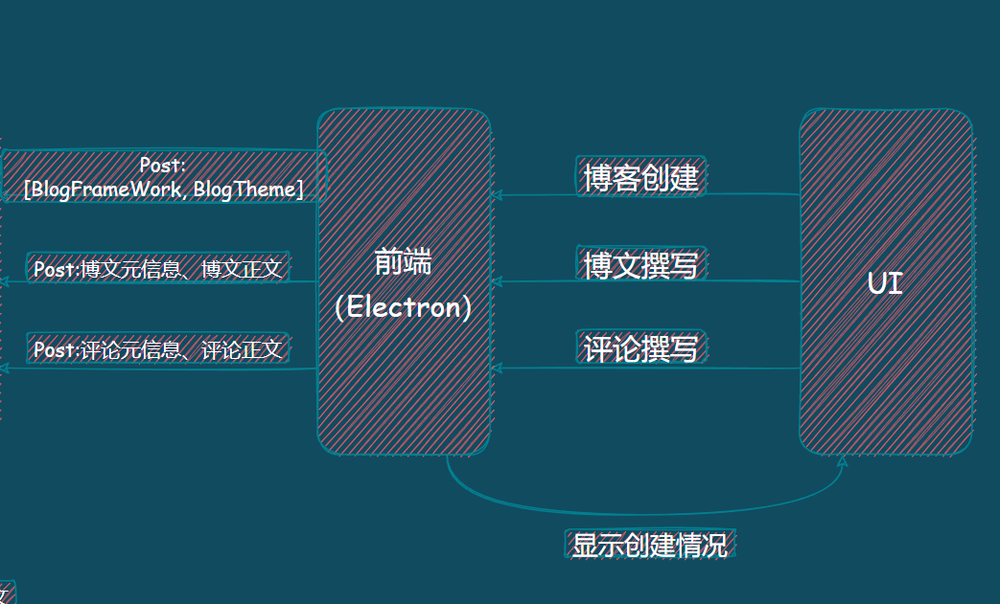
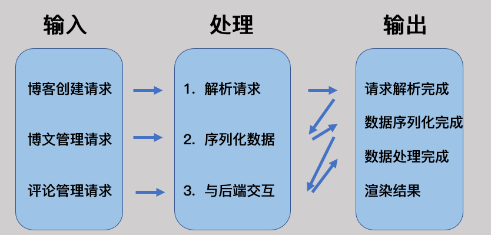
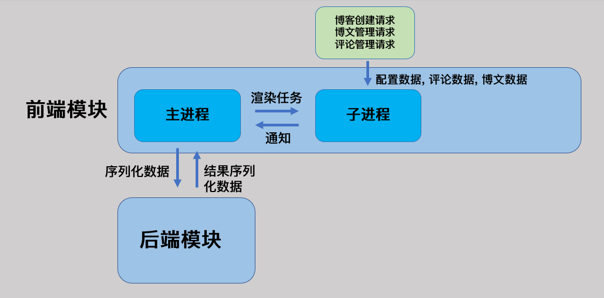
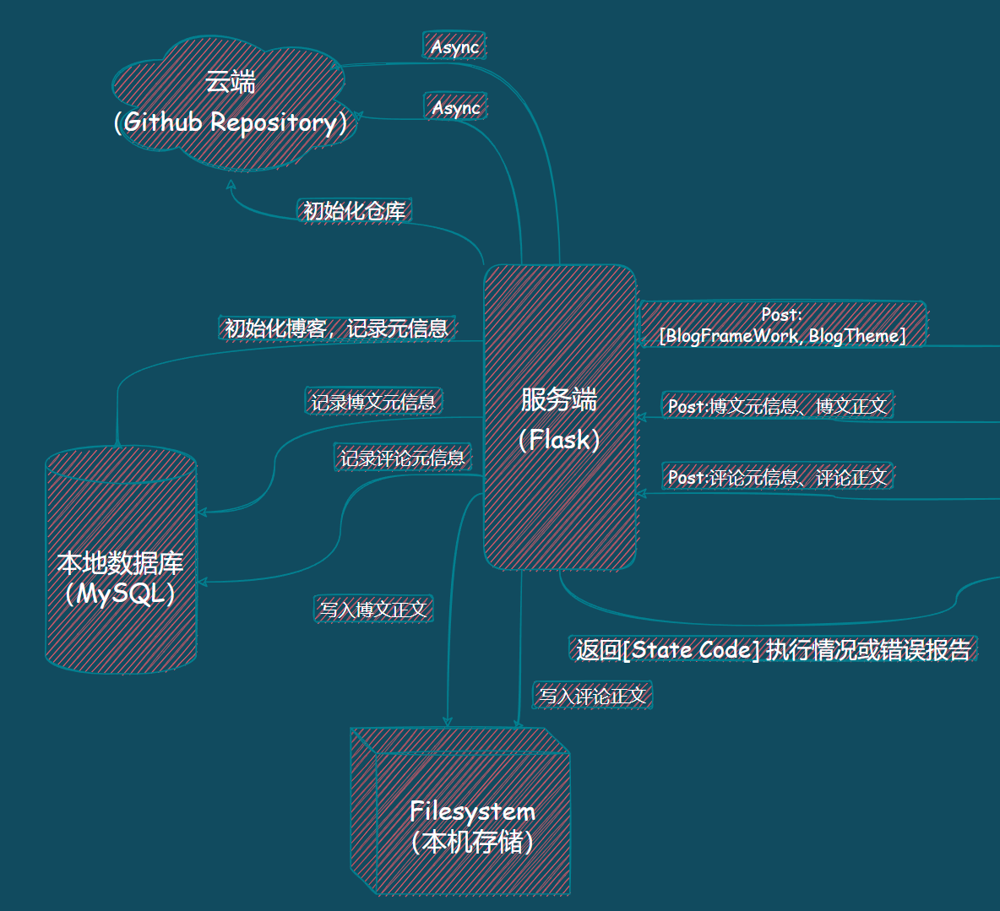
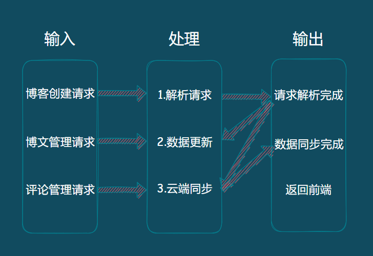
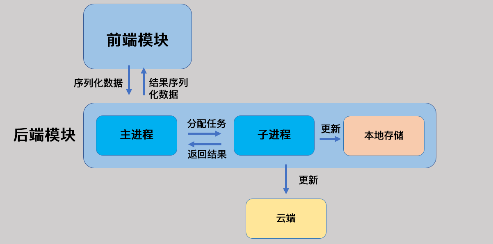
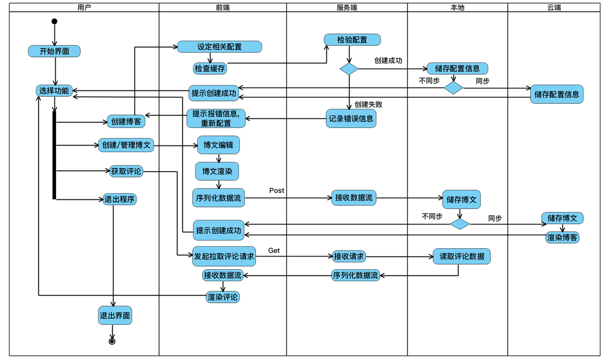
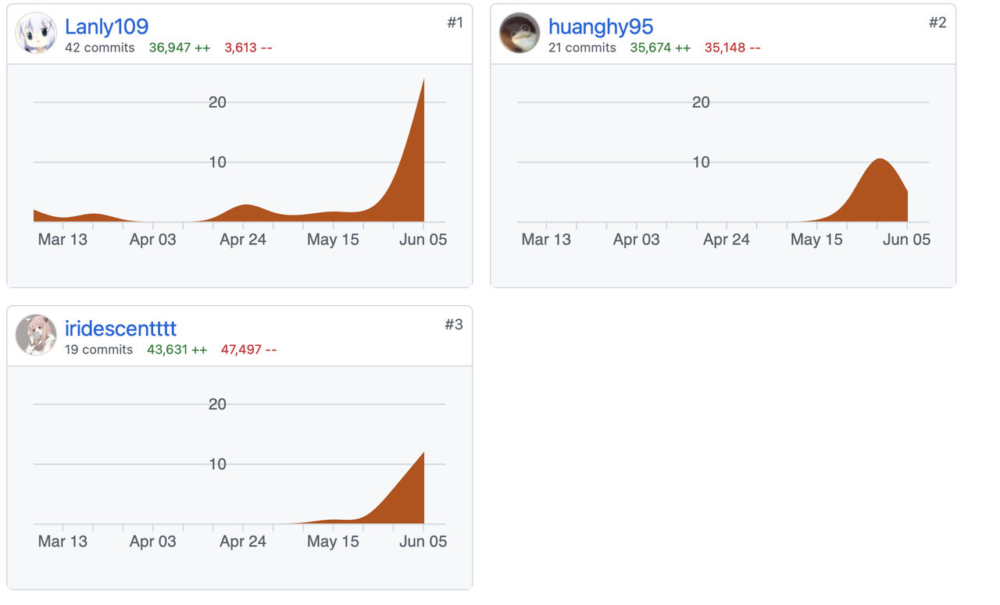

# LabWeek17 - System Development Report

# 引言

## 编写目的

软件工程导论课程项目NBlog的开发已经基本完成。本项目开发总结报告主要用来回顾总结过去一个学期的开发历程，旨在总结经验教训，同时也给其他人提供一份参考。希望通过总结我们在开发过程中遇到的问题和采取的方法，对以后的项目开发起到一定的指导性的意义。

## 背景

对于想要成为一个个性化的博主的人来说，想要拥有自己的博客还是有一定上手难度的。如果使用csdn或者博客园等网站进行博客开发，通常会为其广告所困扰，且由于数据全部上传存在一定的隐私泄露问题。如果使用自己服务器搭建博客，又可能因为不熟悉命令行或者看不懂代码出现bug而使得小白崩溃，觉得创建以及维护自己博客是一件极其痛苦的事情。

本产品名称为NBlog, 意在帮助小白搭建个人博客， 对于小白极度友好，将实现一键搭建博客的功能，实现自己的个性化博客搭建。不同于花里胡哨的博客网站，本软件完全基于本地环境不进行数据的上传，强有力的保护了用户的隐私。另外，本软件可以开源并鼓励开发者社区开发相关插件，将建立一个良好的开发生态。

本产品技术上的运行支持平台为 Windows, Linux, Mac, 博客搭建工具为 Hexo & Hugo & Vuepress, 前端界面由 electron 搭建。本次项目开发维护人员为Lanly, ztl, hhy。

1. ## 定义

**用户**：使用NBlog搭建博客并管理博客的用户群体

**博客框架**：用户所选用的博客主体框架，如Hexo、Hugo

**博文**：用户创建、编辑并管理的博文文本及元信息

**评论**：第三者对用户博文添加的评论文本及元信息

**云端仓库**：持久化于云端的存放博客的仓库，如Github

**用户帐号**：在应用信息系统中设置与保存、用于授予用户合法登陆和使用应用信息系统等权限的用户信息，包括用户名、密码以及用户真实姓名、单位、联系方式等基本信息内容。

## 参考资料

《NBlog开题报告》

《NBlog可行性分析报告》

《NBlog需求规格说明书》

《NBlog概要设计说明书》

《NBlog详细设计说明书》

# 实际开发结果

## 产品

a. 程序模块说明。本程序分成前端, 后端两个模块, 其功能和流程如下所示. 

### 2.1.1 前端模块

#### 流程图

#### 时序图

#### 接口

### 2.1.2 后端

#### 流程图

#### 时序图

#### 接口

b. 程序版本说明

本程序目前只开发出一个版本, 完成了程序的基本功能。本程序目前还在不断迭代更新中，日后会发行更多功能更强，更加稳定的版本。

在版本 v1.0 中, 我们已经开发出了 win, mac, linux 三个不同平台的 NBlog 适配版本，成功实现了跨平台同步的功能。

c. 文件架构：

- frontend文件夹：
  - 前端模块， 里面包含了 ant design pro 的基本框架，实现了前端各个页面 UI 以及它们之间相互耦合的逻辑代码。

- backend 文件夹：
  - 后端模块，里面包含了 go git 的基本框架， 实现了 http 通信和后端本第存储功能以及云端同步功能

- .github/workflow 文件夹:
  - 用于控制 github action 的逻辑, 实现云端不是模块的功能。

d. 数据存储

本次程序采用本地数据存储，通过 hexo 进行初始化后将文章存放在 src 文件夹中来进行文章的存储。程序配置通过文件夹下相应的配置文件进行保存。

## 主要功能和性能

在功能需求方面，本软件初始要求如下：

- 博客创建
  - 用于创建博客，创建本地文件夹相关数据

- 用户创建博文
  - 存储本地文章数据并同步云端

- 用户创建评论
  - 创建相关评论

- 用户请求退出
  - 请求退出程序

- 程序退出

在性能需求方面，本软件初始要求如下：

- 精度要求

要按照严格的数据格式输入，对符合数据格式要求的输入进行提示，对正常操作进行提示，对非法操作进行错误提示。

- 时间特性要求

软件启动时间：软件启动时间应该迅速，让用户能够快速进行博客的管理和更新，启动时应有相应画面，软件应在5秒内启动完毕。

系统实时响应时间：软件使用过程中，对用户在各个功能模块的鼠标点击、键盘输入等操作事件的响应时间需在用户能够容忍的范围之内，一般要求小于1秒。在进行部署时，应有实时进度显示。

数据的转换和传送时间：对软件不同模块间的数据交互，要求数据的转换和传送时间不得超过10秒。

- 灵活性要求

软件能够支持鼠标、键盘等多种操作方式的使用。软件的设计和实现需要考虑到运行环境的变化，并能够在运行环境变化的情况下正常使用。同时，软件需要兼容其他软件接口的变化，以保证在不同运行环境，不同软件接口的情况下的正常使用。具体要求如下：

操作方式上的变化：软件应支持多种操作方式，例如鼠标、键盘等。

运行环境的变化：软件的设计和实现需要考虑其运行环境的变化，并能对不同的运行环境提供支持。具体而言，软件应支持Windows10及以上版本的操作系统，尽可能减少软件运行时库的依赖。

同其他软件接口的变化：当其他软件的接口发生变化时，该软件应能够适应接口的变化。

精度和有效时限的变化：灵活性要求软件能够方便的适应精度和有效时限的变化。

计划的变化或改进：软件应具有足够的灵活性，以适应将来有可能会出现的需求更改或增加。

具体发行版本中，已经完成了上述功能和性能要求，并进行了相关测试，功能基本实现且稳定。

## 基本流程

用户使用NBlog服务涉及的主要流程逻辑包括：

博客创建

1. 前端向服务端发送Post请求
2. 服务端将博客信息存储到本地
3. 云端init仓库

1. 前端提示用户创建博文

用户创建博文

1. 前端向服务端发送Post请求
2. 服务端将博文信息存储到本地
3. 云端同步仓库

前端提示用户创建评论

用户创建评论

1. 前端向服务端发送Post请求
2. 服务端将评论信息存储到本地
3. 云端同步仓库

用户请求退出

程序退出

## 进度

原定计划进度于 17 周完成项目开发, 目前已经实现基本功能, 并且已经在 github 上开源 release 版本. 具体来说通过人工测试，基本功能已经测试完毕，但仍有一些界面 UI 需要优化， 后端测试并不全面细致。

针对原定计划进度来说，实际进度是提前了。这得益于三人小组的高效合作以及合理沟通。在技术栈层次，每个人对于其负责部分的快速学习与实现对于加快实际进度来说也起到了举足轻重的作用。

 

## 费用

- 技术资源费用：涉及的技术栈包括：

- 人力资源费用：三人小组，分工明确，协作开发。

- 预算费用：主要是人力和时间的开销

- 时间开销：每人每周工作时间大致为8h

# 开发工作评价

## 实际生产效率

以下是三人的工作量证明图。从图中可以看出, 三人都积极参与了开发工作，对最终产品的完成做出了重要贡献。

## 对产品质量的评价

由于还没进行细致全面的软件测试，从人工测试来看，目前代码并没有什么错误指令。

## 对技术方法的评价

- Electron：对网站打包成桌面应用，自带的多平台支持，使得我们打包时能够非常方便地打包出各平台的安装包。配置简洁。

- ApiFox：早期设计前后端接口时可以详尽便捷地书写接口标准，包括url和body的json格式，同时自带的mock能够生成示例数据，便于更加清楚地看到传输数据的格式。同时可以与小组成员分享协作。ApiFox自带的本地服务器和mock生成器能分别测试后端和前端，在前后端还没开发完时就可以进行测试，使得能在对接前尽可能测试，使得对接时变得顺利。

- Github Action：运用Github Action可以非常方便地生成多平台多架构下的软件，并打包好发布到Release。节省了手动生成打包的人力资源。同时在软件功能中，博客网站构建所需要的依赖npm和hexo也交由Github Action实现，减少了用户机子的安装依赖，实现轻量便捷。

- Go-git/Go-github：利用golang兼容的git、github工具包，简化了复杂的网络请求和响应处理。将后端涉及云端的相关操作模块进行了大幅度的简化，同时通过package内预定好的异常处理，也使代码组织更加容易，更便于开发。

- Antd design pro：该框架为阿里前端模块的框架，完成了对于路由，界面的合理管理。在组件调用层次，它基于 React 实现了各个组件的解耦，方便前端进行调用。另外，ant design pro 的组件也非常美观大方，符合人们的审美要求。

## 出错原因的分析

此次开发过程较为顺利，但第一次解除go-react前后端协同框架，同时涉及Electron、git等组件操作，过程还是难免遇到一些问题。但在我们的组内积极沟通和努力尝试下，各种问题均得到较好地解决，下面简要列举几项主要问题:

前期技术选型比较模糊。想了几套方案，因为涉及组件比较多，而且也没有很多较好的现有参考资料。因此在几个方案上都做了一些尝试，最终选择了react+go这套方案，最后效果也比较好，在执行效率、编程难度、跨平台表现等方面都证明该方案是个非常不错的选择。

前端界面仍需要一点 UI 优化，可以在后续的版本中进行相应的改进。同时，后端 GO 

后端实现增加仓库secret功能时，对于获取到的public key进行加密，[GitHub Actions 机密 - GitHub Docs](https://docs.github.com/cn/rest/actions/secrets#create-or-update-a-repository-secret)写的非常简略，且示例没有Golang。最后在看到格式解释以及其他语言的示例，才明白得到的public key是base64编码，需要先解码后用该public key加密，然后将加密后的结果再经过base64编码再发送。这样的操作应该是常规操作，但因为不熟悉才在这研究花了好大时间。

# 经验与教训

在这项开发过程中，技术交流方面，我们会使用飞书云文档不断去整理各自的工作情况和做好总结，通过这种协作沟通，对以后的协同开发能力都有一定的帮助，同时，通过编写完善各种相关文档，完整体会到了一个项目从提出到落地的全过程，收获颇丰。

在代码编写和项目完成部分，同时我们在实现项目过程中也不断完善迭代一些现有功能，提出一些有必要的新features，并做出相应改进，这也是一个不断学习提升的过程
