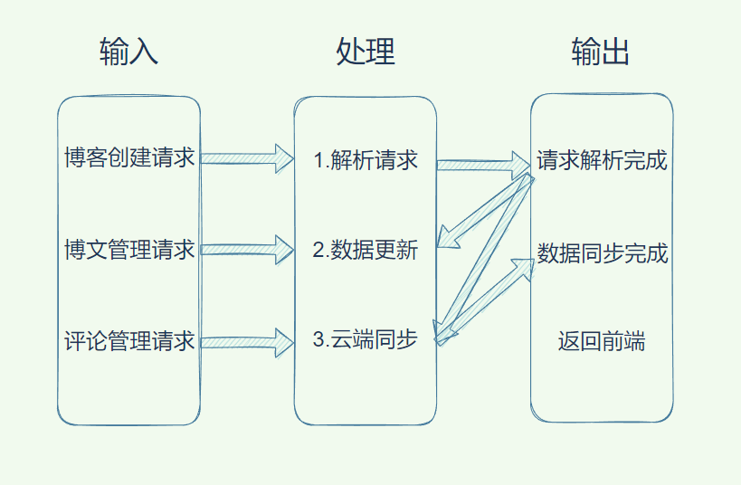
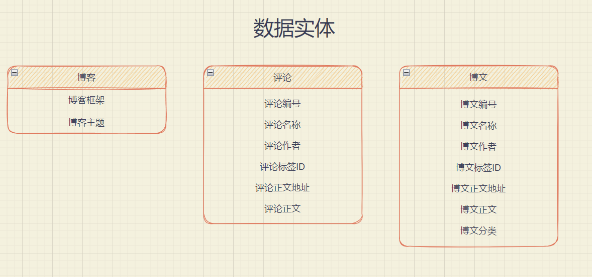
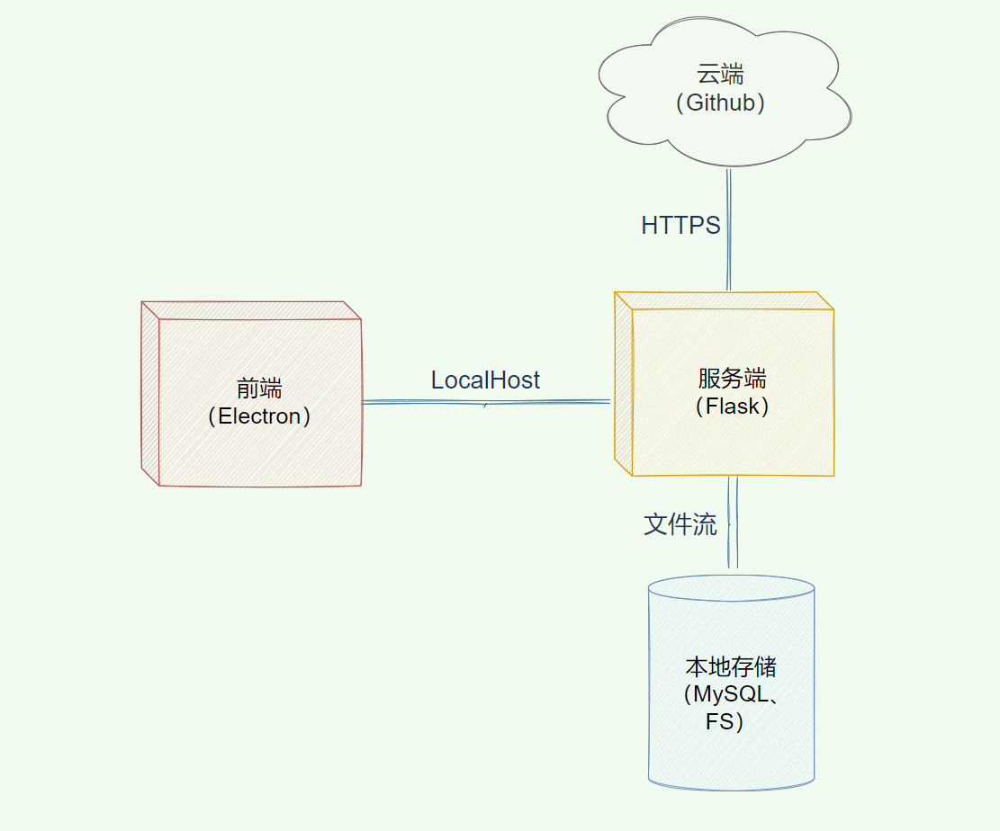

# Architectural Design Specification

# 概要设计说明书

概要设计说明书又可称系统设计说明书，这里所说的系统是指程序系统。编制的目的是说明对程序 系统的设计考虑，包括程序系统的基本处理流程、程序系统的组织结构、模块划分、功能分配、接口设计、 运行设计、数据结构设计和出错处理设计等，为程序的详细设计提供基础。编制概要设计说明书的内容 要求如下：

# 1 引言

## 1.1 编写目的

本概要设计文档主要用来指导NBlog的详细设计工作，为详细设计提供统一的参照标准，其中包括系统的总体设计、内外部接口、系统架构、编程模型以及其他各种主要问题的解决方案。

预期读者：NBlog开发维护者、项目审核者

## 1.2 背景

对于想要成为一个个性化的博主的人来说，想要拥有自己的博客还是有一定上手难度的。如果使用csdn或者博客园等网站进行博客开发，通常会为其广告所困扰，且由于数据全部上传存在一定的隐私泄露问题。如果使用自己服务器搭建博客，又可能因为不熟悉命令行或者看不懂代码出现bug而使得小白崩溃，觉得创建以及维护自己博客是一件极其痛苦的事情。

本产品名称为NBlog, 意在帮助小白搭建个人博客， 对于小白极度友好，将实现一键搭建博客的功能，实现自己的个性化博客搭建。不同于花里胡哨的博客网站，本软件完全基于本地环境不进行数据的上传，强有力的保护了用户的隐私。另外，本软件可以开源并鼓励开发者社区开发相关插件，将建立一个良好的开发生态。

本产品技术上的运行支持平台为 Windows, 博客搭建工具为 Hexo & Hugo & Vuepress, 前端界面由 electron 搭建。

## 1.3 定义

**用户：**使用NBlog搭建博客并管理博客的用户群体

**博客框架：**用户所选用的博客主体框架，如Hexo、Hugo

**博文：**用户创建、编辑并管理的博文文本及元信息

**评论：**第三者对用户博文添加的评论文本及元信息

**云端仓库**：持久化于云端的存放博客的仓库，如Github

**用户帐号：**在应用信息系统中设置与保存、用于授予用户合法登陆和使用应用信息系统等权限的用户信息，包括用户名、密码以及用户真实姓名、单位、联系方式等基本信息内容。

## 1.4 参考资料

《NBlog开题报告》

《NBlog可行性分析报告》

《NBlog需求规格说明书》

# 2 总体设计

## 2.1 需求规定

### **IPO图**

### 数据实体

本项目的数据实体主要包括博客、博文以及评论，具体实体规范细则如下：

## 2.2 运行环境

### 2.2.1 设备

Inter或其他系列的微型计算机，内存 500MB以上，硬盘 500MB以上。

### 2.2.2 支持软件

操作系统和版本： Windows 10 以上。

与该软件有关的软件组件：typora， hexo

后续可能扩展环境：mysql

### 2.2.3 接口

本软件拟采用 2333 端口的 TCP 传输作为软件前后端间的通信协议,  3332 端口的 TCP 传输作为本地机器和服务器软件进程之间的通信协议.  

### 2.2.4 控制

| 模块名称 | 运行方式 | 控制信号       | 控制去向                     |
| -------- | -------- | -------------- | ---------------------------- |
| 用户界面 | electron | 用户调用或运行 | 调用前端模块                 |
| 前端     | electron | 用户来源信号   | 与后端进行通信               |
| 后端     | python   | 前端来源信号   | 调用本地部署方法以及云端通信 |
| 云端     | python   | 后端来源信号   | 云端部署                     |

## 2.3 基本设计概念和处理流程

### 基本设计概念

本软件主要设计了用户界面， 前端， 服务端和云端四个模块，分别负责读取用户输入信息、前端渲染、本地部署、云端部署四大功能。 

### 数据流图 

### 处理流程

用户使用NBlog服务涉及的主要流程逻辑包括：

1. 博客创建
   1. 前端向服务端发送Post请求
   2. 服务端将博客信息存储到本地
   3. 云端init仓库
2. 前端提示用户创建博文
3. 用户创建博文
   1. 前端向服务端发送Post请求
   2. 服务端将博文信息存储到本地
   3. 云端同步仓库
4. 前端提示用户创建评论
5. 用户创建评论
   1. 前端向服务端发送Post请求
   2. 服务端将评论信息存储到本地
   3. 云端同步仓库
6. 用户请求退出
7. 程序退出

## 2.4 结构

本软件的结构组件主要包括前端界面，日志系统，插件系统，数据库系统， 游客， 评论管理系统， 用户， 博文管理系统，软件配置系统，服务器和文本编辑渲染系统。 

其中前端界面和文本编辑渲染系统总共构成了前端， 日志系统， 评论管理系统， 博文管理系统和软件配置系统共同构成了后端。 用户在本地进行操作， 服务器为云端，游客由因特网进入访问博客网站并发表评论。

以上NBlog系统的部署图描绘了系统各部分的运行资源安排，主要包括四部分资源：

- 前端（Electron）
- 服务端（Flask）
- 本地存储（MySQL、FS）
- 云端（Github Repo）

资源间关系主要有三类：

- 前端与服务端之间通过本地LocalHost连通
- 服务端与云端通过HTTPS连通
- 服务端与本地存储通过文件流连通

## 2.5 功能需求与程序的关系

|                                                   | 前端Electron | 服务端Flask | 云端Github | 本地持久化 |
| ------------------------------------------------- | ------------ | ----------- | ---------- | ---------- |
| **feat1.** 提供友好的用户界面                     | √            |             |            |            |
| **feat2.** 用户能完成博客创建、博文管理等基本功能 | √            | √           |            | √          |
| **feat3.** 用户能将博文博客保存到云端             |              |             | √          |            |
| **feat4.** 用户能对博客进行个性化构造与管理       | √            | √           |            |            |
| **feat5.** 提供评论等相关生态                     | √            | √           | √          | √          |

## 2.6 人工处理过程

人工处理过程主要包含以下几个方面：

- 软件配置设定。
- 软件个性化功能拓展，如新增主题等操作。
- 社区的维护以及社区中用户群体的信息交互。

## 2.7 尚未解决的问题

1. UI设计问题
2. 社区生态问题
3. 推广宣传问题
4. 多语言多平台支持问题

# 3 接口设计

## 3.1 用户接口

用户接口主要以用户界面的形式呈现。

用户界面是程序中用户能看见并与之交互作用的部分,设计一个好的用户界面是非常重要的,本设计将为用户提供美观,大方,直观,操作简单的用户界面. 

用户界面主要包括:

- 文档归档管理界面
- 博客撰写界面
- 拓展功能界面
  - 对接其他软件的 API
  - 自定义脚本运行
  - 新增插件功能

### 3.1.1 文档归档管理界面

文件归档管理界面可以

- 查看用户发表的博文
- 发表新博文
- 选择博文，进行删除、修改操作

### 3.1.2 博客撰写界面

该界面运用markdown语法，左边为输入框，右边为markdown渲染出来的结果。

### 3.1.3 拓展功能界面

该界面显示未来可拓展的插件，可以选择性点击运行某些独立软件。

## 3.2 外部接口

### 3.2.1 硬件接口

Inter或其他系列的微型计算机，内存 500MB以上，硬盘 500MB以上。

### 3.2.2 软件接口

运行在 Windows 10 平台之上.

## 3.3 内部接口

### 3.3.1 通信接口

本软件拟采用 2333 端口的 TCP 传输作为软件前后端间的通信协议,  3332 端口的 TCP 传输作为本地机器和服务器软件进程之间的通信协议.  

# 4 运行设计

## 4.1 运行模块组合

用户使用NBlog服务涉及的主要流程逻辑及其涉及到的运行模块如下所示.

1. 博客创建：涉及用户界面、前端、后端、云端这四大模块的组合
   1. 前端向服务端发送Post请求
   2. 服务端将博客信息存储到本地
   3. 云端init仓库
2. 前端提示用户创建博文：涉及用户界面、前端、后端这三部分模块的组合
3. 用户创建博文：涉及用户界面、前端、后端、云端这四大模块的组合
   1. 前端向服务端发送Post请求
   2. 服务端将博文信息存储到本地
   3. 云端同步仓库
4. 前端提示用户创建评论：涉及用户界面、前端、后端这三部分模块的组合
5. 用户创建评论：涉及用户界面、前端、后端、云端这四大模块的组合
   1. 前端向服务端发送Post请求
   2. 服务端将评论信息存储到本地
   3. 云端同步仓库
6. 用户请求退出：涉及用户界面、前端、后端这三大模块的组合
7. 程序退出：涉及前端、后端这两模块的组合

具体软件的运行组合位程序多窗口的运行过程中能较好的交换信息，处理数据

## 4.2 运行控制

1. 博客创建时需要先进入博客设置界面，然后进行每一个属性的配置信息填写。之后用户点击完成按钮实现博客的创建。
2. 创建博文时要先进入博文管理界面，再点击【创建博文】按钮，然后在弹出的文本框内进行博文的输入。在完成撰写之后，用户通过点击发表博文按钮进行博文的创建。
3. 更新博文时要首先进入博文管理界面，在博文文本框进行博文的更新，再点击【更新博文】按钮，在弹出的再三确认窗口完成删除博客的逻辑。
4. 删除博文时要首先进入博文管理界面，再点击【删除博文】按钮，在弹出的再三确认窗口点击确认按钮，完成删除博文的操作。
5. 在进行评论管理相关操作时首先要进入对应博文页面中，再在评论区文本框中通过点击进行评论管理。

## 4.3 运行时间

每个操作（点击）反应时间不超过0.5秒。

处理时间，涉及到网络的处理的时间不应超过10秒，并应有实时状态表示进展。

# 5 系统数据结构设计

## 5.1 逻辑结构设计要点

配置相关

| 数据元素名称 | 表示法          | 类型   | 范围    |
| ------------ | --------------- | ------ | ------- |
| 博客框架     | BlogFrameWork   | String | Varchar |
| 博客主题     | BlogTheme       | String | Varchar |
| 用户信息     | UserInformation | String | Varchar |

博文相关

| 数据元素名称 | 表示法         | 类型           | 范围              |
| ------------ | -------------- | -------------- | ----------------- |
| 博文编号     | BlogID         | Integer        | [INT_MIN,INT_MAX] |
| 博文名称     | BlogName       | String         | Varchar           |
| 博文标签ID   | BlogTag        | Array<Integer> | [0,INT_MAX]       |
| 博文作者     | BlogAuth       | String         | Varchar           |
| 博文创建日期 | BlogCreateTime | Date           | Date              |
| 博文正文地址 | BlogUrl        | URL            | NULL              |
| 博文正文     | BlogContext    | String         |                   |
| 博文分类     | BlogCategories | Integer        | [INT_MIN,INT_MAX] |
| 标签         | Tag            | String         | Varchar           |
| 分类         | Categories     | String         | Varchar           |

评论相关.

| 数据元素名称 | 表示法         | 类型    | 范围              |
| ------------ | -------------- | ------- | ----------------- |
| 评论ID       | CommentID      | Integer | [INT_MIN,INT_MAX] |
| 评论日期     | CommentTime    | Date    | Date              |
| 评论作者     | Commenter      | String  | Varchar           |
| 评论对应博文 | CommentBlogID  | Integer | [INT_MIN,INT_MAX] |
| 评论正文     | CommentContext | String  | Varchar           |

## 5.2 物理结构设计要点

下面给出每个数据结构中的每个数据项的物理结构设计要点。

|          | 存储要求              | 访问方法 | 存取单位 | 索引     | 设备          | 保密级别 |
| ---------- | ----------------------- | ---------- | ---------- | ---------- | --------------- | ---------- |
| 配置信息 | 本地关系型数据库&云端 | sqlite3  | 记录     | 聚集索引 | 本地&云服务器 | 强       |
| 博文信息 | 本地关系型数据库&云端 | sqlite3  | 记录     | 聚集索引 | 本地&云服务器 | 强       |
| 评论信息 | 本地关系型数据库&云端 | sqlite3  | 记录     | 聚集索引 | 本地&云服务器 | 强       |

## 5.3 数据结构与程序的关系

下面给出各个数据结构与访问这些数据结构的各个程序之间的对应关系。

|          | 用户界面 | 前端 | 后端 | 云端 |
| ---------- | ---------- | ------ | ------ | ------ |
| 配置信息 |          | √   | √   | √   |
| 博文信息 | √       | √   | √   | √   |
| 评论信息 | √       | √   | √   | √   |

# 6 系统出错处理设计

## 6.1 出错信息

| 错误类型                     | 错误提示                                       |
| ---------------------------- | ---------------------------------------------- |
| **err1.** 配置错误           | 请输入正确的配置信息                           |
| **err2.** 访问未定义路径     | 不存在此页面                                   |
| **err3.** 无法连接服务器 | 请重新检查服务器地址，或者检查网络情况是否连通 |
| **err4.** 参数错误           | 无法解析博客数据                               |
| **err5.** 未知错误           | Oops! 程序发生了错误!                          |

## 6.2 补救措施

1. 后备技术：NBlog具有独立的日志模块，并将写日志操作注入到主逻辑中，使得在程序的正常运行过程中，能将数据元信息以及一些重要的性能指标持久化到日志文件中。这样当灾难发生时，可以进行相应恢复，使系统容灾性和可用性得到提高。
2. 降效技术：Nblog 将在程序用户界面提供运维人员的联系方式， 用户可以通过联系运维人员，然后运维人员将人工审查用户运行异常日志，作为降效处理方式的人工依据。
3. 恢复及再启动技术：让多件事务做绑定，一旦其中一个撤销，其余所有相关的事务也要撤销。若事务已经写入数据库，其余相关的事务也要重做。采用投票机制进行恢复：多个组件或子系统采用相同或不同地算法计算同一件事，如果各自结果不一致，则少数服从多数。

## 6.3 系统维护设计

1. 日志模块

NBlog 的日志模块注入在主逻辑中， 利用内嵌的日志模块，用户或者管理人员可以准确的掌握程序的运行状态，从而有利于程序崩溃的补救，提高系统的容灾性和可用性。

2. 错误回滚模块

在程序遇到错误的时候，会自动回滚到上一个日志记录点并向用户进行提示。

3. 核心转储模块

程序将近崩溃时，会自动记录此时的内存快照，方便编程人员诊断和调试程序。
