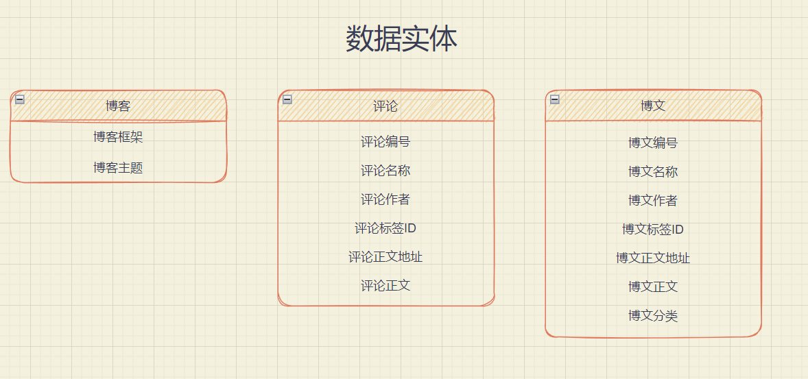

# Part 1 软件项目需求分析报告

准备项目软件项目需求分析报告的框架，至少包括：成本预算、交付进度、开发方法、质量保证、验证和确认准则、验收规程。

## 一、报告概述

本项目需求分析报告针对项目背景、目前进度以及期望达到的目标，针对成本预算、交付进度、开发方法、质量保证、验证和确认准则、验收规程分别进行了具体分析，对软件项目需求及一些其他细节进行了阐述。

## 二、项目目标

NBlog是一款个人博客一键个性化搭建平台。意在帮助小白搭建个人博客， 对于小白极度友好，将实现一键搭建博客的功能，实现自己的个性化博客搭建。不同于花里胡哨的博客网站，本软件完全基于本地环境不进行数据的上传，强有力的保护了用户的隐私。另外，本软件可以开源并鼓励开发者社区开发相关插件，将建立一个良好的开发生态。

## 三、项目成本预算

由于本次开发属于校内开发，且规模较小，因此项目成本主要落在时间开销成本和人力资源开销成本。

时间开销成本方面，团队内每人每周开发时间大约在8小时左右，同时在平时不定期开进度交流会议，交流想法、协调进度。

人力资源开销成本方面，本次项目开发仅由组内三人完成，没有而外聘请专家或开发人员的开销。

## 四、项目交付进度

## 五、项目开发方法

开发方法主要包括协同手段、开发环境以及开发所用技术栈。

协同手段方面，本次项目开发采用飞书作为协同交流工具，问题交流、进度协调、任务分配与会议记录在飞书上完成。

代码管理方面，采用Github作为代码版本管理工具，Github仓库地址为：https://github.com/Lanly109/NBlog

开发环境方面，本次开发环境主题为Linux+Python，可视化方面会用到脚本语言如CSS、JS。

开发所用技术栈：

- 具体语言：使用electron+python进行开发

- 作为一个面向小白的博客搭建软件，好看的可视化界面必不可少。所以需要相关知识开发一个好看的可视化界面。
- 数据在本地的记录同步问题。
- electron是十分成熟的图形化编程框架，现在非常流行的VSCode就是基于electron开发的。同时python后端的flask框架也十分成熟，易上手，轻量便捷。
- 常见的如Hexo、Hugo、Vuepress都是可以通过命令行部署的博客框架. 

## 六、项目质量保证

### 6.1 项目质量目标

NBlog首先要求能实现项目基本功能，即能为用户提供一个一体化的博客搭建平台。进一步的，希望软件能提供一个较高质量的UI，以改善用户的用户体验。再者，希望能够加入一些个性化插件等额外功能，提高用户个性化能力。

### 6.2 项目质量保证措施

保证项目质量的措施主要包括：

- 每到一个Milestone之后检查软件功能是否完善，用户体验是否良好
- 开发过程中先进行产品设计和用户需求分析，据此设计接口文档，保证用户的需求能在开发过程中得以体现
- 开发前事先设计好工程结构和程序规范，保证最终项目落地质量较高

## 七、项目验证和确认准则

软件的验证与确认是数字化仪控系统的关键技术之一，其质量的评估难以量化的给出。

结合本项目背景及基本流程，设计项目验证和确认准则手段如下：

1. 计划先于行动，没有计划和大纲无法开展工作。
2. 在开发版本迭代过程中，结合单元测试和随机测试对项目可靠性以及准确性进行检验。
3. 所有结果和过程都应详细的记录并保存，确保可追溯性。
4. 可编写回归测试脚本或结合CI，对开发的每次commit进行测试验证

## 八、项目验收规程

### 8.1 初步验收

首先进行初步验收，主要是完成软硬件系统的初步运行情况，IT项目可能涉及硬件设备的验收，也可能涉及软件系统的验收，也可能同时涉及软件和硬件的验收，由于对于机房装修这样复杂的项目，涉及到几个硬件子系统和软件子系统的验收；对于硬件系统的验收，存在两个验收步骤，在设备到货后需要验收设备到货情况，在调试完成后需要进行设备试车验收（试运行），一般付款条件为试车验收通过，不是到货验收通过。

### 8.2 根据初步验收结果进行整改

如果初步验收不符合验收条件，再进行整改，根据初步验收整改意见进行相关的整改，整改完成后再次提请验收。

### 8.3 复验

当完成整改后，再次组织进行复验。

### 8.4 检验验收是否通过

如果本次验收通过，将检验初步验收涉及的各阶段验收是否完成，如果初步验收完成，将进入正式运行阶段。如果还存在后续验收阶段，将重复2~3步，直至所有子系统验收合格。

# Part 2 SRS

## 2.1 外部接口需求

### 2.1.1 用户界面

用户界面是程序中用户能看见并与之交互作用的部分,设计一个好的用户界面是非常重要的,本设计将为用户提供美观,大方,直观,操作简单的用户界面. 

外部接口的用户界面部分按Windows应用软件用户界面的规范来设计. 另外为了实现更加美观、 方便易用的用户界面, 本设计将采用 electron 框架结合前端语言 HTML+CSS+JS 进行构建. 

用户界面主要包括:

- 文档归档管理界面
- 博客撰写界面
- 拓展功能界面
  - 对接其他软件的 API
  - 自定义脚本运行
  - 新增插件功能

经过 10-15min 界面引导之后, 用户能够熟练掌握软件功能并在 15-20 min 中内部署好自己的第一个 blog.

### 2.1.2 硬件接口

Inter或其他系列的微型计算机，内存 500MB以上，硬盘 500MB以上。

### 2.1.3 软件接口

运行在 Windows 10 平台之上.

### 2.1.4 通信接口

本软件拟采用 2333 端口的 TCP 传输作为软件前后端间的通信协议,  3332 端口的 TCP 传输作为本地机器和服务器软件进程之间的通信协议.  

## 2.2 性能需求

### 2.2.1 精度要求

要按照严格的数据格式输入，对符合数据格式要求的输入进行提示，对正常操作进行提示，对非法操作进行错误提示。

### 2.2.2 时间特性要求

软件启动时间：软件启动时间应该迅速，让用户能够快速进行博客的管理和更新，启动时应有相应画面，软件应在5秒内启动完毕。

系统实时响应时间：软件使用过程中，对用户在各个功能模块的鼠标点击、键盘输入等操作事件的响应时间需在用户能够容忍的范围之内，一般要求小于1秒。在进行部署时，应有实时进度显示。

数据的转换和传送时间：对软件不同模块间的数据交互，要求数据的转换和传送时间不得超过10秒。

### 2.2.3 灵活性要求

软件能够支持鼠标、键盘等多种操作方式的使用。软件的设计和实现需要考虑到运行环境的变化，并能够在运行环境变化的情况下正常使用。同时，软件需要兼容其他软件接口的变化，以保证在不同运行环境，不同软件接口的情况下的正常使用。具体要求如下：

操作方式上的变化：软件应支持多种操作方式，例如鼠标、键盘等。

运行环境的变化：软件的设计和实现需要考虑其运行环境的变化，并能对不同的运行环境提供支持。具体而言，软件应支持Windows10及以上版本的操作系统，尽可能减少软件运行时库的依赖。

同其他软件接口的变化：当其他软件的接口发生变化时，该软件应能够适应接口的变化。

精度和有效时限的变化：灵活性要求软件能够方便的适应精度和有效时限的变化。

计划的变化或改进：软件应具有足够的灵活性，以适应将来有可能会出现的需求更改或增加。

## 2.4 设计约束

### 2.4.1 开发环境

Windows, Mac 和 Linux 平台.  

### 2.4.2 编程语言

前端：electron 框架结合前端语言 HTML+CSS+JS 进行构建。

后端：Flask框架结合后端语言Python进行构建

### 2.4.3 遵循的规范

软件的设计和开发过程需要严格按照敏捷开发标准，根据软件的设计方案来进行。软件开发过程应遵循软件工程规范，对过程和版本进行管理和控制。

后端接口设计采用Restful API标准设计。

### 2.4.4 测试环境

软件的测试应严格在用户使用该软件可能的环境进行测试，如在Windows10、11。

### 2.4.5 软件交付形式

本软件拟 使用 exe 可执行程序以及二进制程序安装包的形式进行交付。

### 2.4.6 软件交付日期

2022 年 6 月 30 日

## 2.5 软件系统属性

## 2.6 其他需求

### 2.6.1 易用性需求

作为一款适用于电脑小白的博客搭建软件的设计和实现遵循易用性原则，工具的安装和入门，工具的用户界面布局，使用工具的操作方式等方面都应符合主流软件的设计风格与要求。

1) 操作简单，设计合理。

2) 进行博客部署前，该软件应提供详尽的帮助，以便让用户明白搭建博客的过程。

3) 博客部署时应有必要的操作提示信息。

## 3 具体需求

## 3.1 外部接口需求

### 3.1.1 用户界面

用户界面是程序中用户能看见并与之交互作用的部分,设计一个好的用户界面是非常重要的,本设计将为用户提供美观,大方,直观,操作简单的用户界面. 

外部接口的用户界面部分按Windows应用软件用户界面的规范来设计. 另外为了实现更加美观、 方便易用的用户界面, 本设计将采用 electron 框架结合前端语言 HTML+CSS+JS 进行构建. 

用户界面主要包括:

- 文档归档管理界面
- 博客撰写界面
- 拓展功能界面
  - 对接其他软件的 API
  - 自定义脚本运行
  - 新增插件功能

经过 10-15min 界面引导之后, 用户能够熟练掌握软件功能并在 15-20 min 中内部署好自己的第一个 blog.

### 3.1.2 硬件接口

Inter或其他系列的微型计算机，内存 500MB以上，硬盘 500MB以上。

### 3.1.3 软件接口

运行在 Windows 10 平台之上.

### 3.1.4 通信接口

本软件拟采用 2333 端口的 TCP 传输作为软件前后端间的通信协议,  3332 端口的 TCP 传输作为本地机器和服务器软件进程之间的通信协议.  

## 3.2 功能需求

程序应具有一键服务器部署博客的功能，能够根据用户选择的主题和博客框架部署对应的博客，并能够管理用户编写的博文，提供文件储存、备份、修改、删除等基本功能，并对博文进行标签选择，类别归档，以及评论管理。未来还将引入社区功能，引入插件模式，可以自定义化扩展程序功能。

### 3.2.1 信息流

#### 3.2.1.1 数据流图 

##### 3.2.1.1.1 数据实体

本项目的数据实体主要包括博客、博文以及评论，具体实体规范细则如下：

##### 3.2.1.1.2 有关的过程

- 涉及操作

     数据流动过程涉及的操作主要包括博客创建、博文撰写和评论撰写，涉及的部分包括服务端、前端和用户UI。

- 一次操作流程

     UI接收用户操作（点击、post提交文本等），解析为数据字典中对应的字段并打包传给前端。前端生成请求和请求体，并打包各元信息发给服务端。服务端解析前端请求，根据不同的操作类型做出不同的响应，一方面和云端Github进行同步，另一方面将数据信息写入本地，其中轻量级的元数据写进数据库，比较重载的内容如博文正文和评论正文写进本机存储，相当于Filesystem。

### 3.2.2 过程描述 

#### 3.2.2.1 一键部署博客过程 

##### 3.2.2.1.1 输入数据实体 

- 用户选择的博客框架（Hexo、Hugo等）
- 用户选择的对应的博客主题（二次元风、赛博朋克风、现代风、简约风等）
- 用户选择的部署地方（通过ip指定的服务器+路径，或本机+路径）
- 用户选择的数据储存方式（Mysql、Sqlite、Radis、Github托管等）
- 用户输入的关于博客网站的自我介绍

##### 3.2.2.1.2 部署过程算法或公式

1. 检查部署机子的操作系统，判断是Windows还是Linux还是MacOS，遇到MacOS则报告相关错误并停止，否则继续。
2. 检查系统的环境是否合适，检查是否装有选择储存方式的数据库（或Git），部署博客必须的npm或yarn，并检查网络是否通畅。如未发现装有对应数据库或npm或yarn，则软件能自动从官方网站的下载链接下载软件的最新版本并自动安装。如网络不通畅则报告相关错误并停止。否则继续。
3. 初始化数据库表，并在用户选择的部署文件系统的路径初始化目录。运用npm或yarn部署博客相关的网页文件，并配置用户自定义的自我介绍。
4. 初始化网页服务器，监听特定端口以处理外部网页访问请求。
5. 打开用户默认浏览器，让用户预览部署结果。

##### 3.2.2.1.3 受影响的数据实体 

- 博客框架
- 博客主题
- 用户信息
- 数据库博客表

#### 3.2.2.2 博文编写过程 

##### 3.2.2.2.1 输入数据实体 

- 用户选择新增的博文
- 用户选择的博文标签
- 用户选择的博文归档类别

##### 3.2.2.2.2 部署过程算法或公式

1. 保存博客文本文件于文件系统中。
2. 更新数据库博文表。
3. 更新博客网页文本目录，生成新的网页，包含该博文。

##### 3.2.2.2.3 受影响的数据实体 

- 博客文章
- 网页文本
- 数据库博客表

#### 3.2.2.3 博文修改过程 

##### 3.2.2.3.1 输入数据实体 

- 用户选择修改的博文
- 用户修改的博文标签
- 用户修改的博文归档类别

##### 3.2.2.3.2 部署过程算法或公式

1. 更新博客文本文件于文件系统中。
2. 更新数据库博文表。
3. 更新博客网页文本目录，包含该博文。

##### 3.2.2.3.3 受影响的数据实体 

- 博客文章
- 网页文本
- 数据库博客表

#### 3.2.2.4 博文删除过程 

##### 3.2.2.4.1 输入数据实体 

- 用户选择删除的博文

##### 3.2.2.4.2 部署过程算法或公式

1. 再三提醒用户是否确认删除该博文，并告知该操作不可逆。
2. 如用户选择否，则停止删除操作，否则在文件系统中删除博文文本，并更新数据库博文表，移除该博文的信息。
3. 更新博客网页文本目录，移除该博文。

##### 3.2.2.4.3 受影响的数据实体 

- 博客文章
- 网页文本
- 数据库博客表

#### 3.2.2.5 博客自动备份过程 

##### 3.2.2.5.1 输入数据实体 

- 用户正在编辑的博文

##### 3.2.2.5.2 部署过程算法或公式

1. 每隔30s，将用户编写的博文文本保存在文件系统中，防止断电丢失等异常情况发生带来的不好体验。

##### 3.2.2.5.3 受影响的数据实体 

- 博客文章

#### 3.2.2.6 评论删除过程 

##### 3.2.2.6.1 输入数据实体 

- 用户选择删除的评论

##### 3.2.2.6.2 部署过程算法或公式

1. 再三提醒用户是否确认删除该评论，并告知该操作不可逆。
2. 更新数据库评论表，删除该评论

##### 3.2.2.6.3 受影响的数据实体 

- 数据库评论表

### 3.2.3 数据构建规范 

#### 3.2.3.1 生成配置文件

##### 3.2.3.1.1 记录类型

日志记录

##### 3.2.3.1.2 组成字段

- 博客框架
- 博客主题
- 用户信息

#### 3.2.3.2 生成博文

##### 3.2.3.1.1 记录类型

日志记录

##### 3.2.3.1.2 组成字段

- 博文编号
- 博文名称
- 博文标签ID
- 博文作者
- 博文创建日期
- 博文正文地址
- 博文正文
- 博文分类

#### 3.2.3.3 生成分类

##### 3.2.3.1.1 记录类型

日志记录

##### 3.2.3.1.2 组成字段

- 分类

#### 3.2.3.4 生成新标签

##### 3.2.3.1.1 记录类型

日志记录

##### 3.2.3.1.2 组成字段

- 标签

### 3.2.4 数据词典

配置相关

| 数据元素名称 | 表示法          | 类型   | 范围    |
| ------------ | --------------- | ------ | ------- |
| 博客框架     | BlogFrameWork   | String | Varchar |
| 博客主题     | BlogTheme       | String | Varchar |
| 用户信息     | UserInformation | String | Varchar |

博文相关

| 数据元素名称 | 表示法         | 类型           | 范围              |
| ------------ | -------------- | -------------- | ----------------- |
| 博文编号     | BlogID         | Integer        | [INT_MIN,INT_MAX] |
| 博文名称     | BlogName       | String         | Varchar           |
| 博文标签ID   | BlogTag        | Array<Integer> | [0,INT_MAX]       |
| 博文作者     | BlogAuth       | String         | Varchar           |
| 博文创建日期 | BlogCreateTime | Date           | Date              |
| 博文正文地址 | BlogUrl        | URL            | NULL              |
| 博文正文     | BlogContext    | String         |                   |
| 博文分类     | BlogCategories | Integer        | [INT_MIN,INT_MAX] |
| 标签         | Tag            | String         | Varchar           |
| 分类         | Categories     | String         | Varchar           |

评论相关.

| 数据元素名称 | 表示法         | 类型    | 范围              |
| ------------ | -------------- | ------- | ----------------- |
| 评论ID       | CommentID      | Integer | [INT_MIN,INT_MAX] |
| 评论日期     | CommentTime    | Date    | Date              |
| 评论作者     | Commenter      | String  | Varchar           |
| 评论对应博文 | CommentBlogID  | Integer | [INT_MIN,INT_MAX] |
| 评论正文     | CommentContext | String  | Varchar           |

## 3.3 性能需求

### 3.3.1 精度要求

要按照严格的数据格式输入，对符合数据格式要求的输入进行提示，对正常操作进行提示，对非法操作进行错误提示。

### 3.3.2 时间特性要求

软件启动时间：软件启动时间应该迅速，让用户能够快速进行博客的管理和更新，启动时应有相应画面，软件应在5秒内启动完毕。

系统实时响应时间：软件使用过程中，对用户在各个功能模块的鼠标点击、键盘输入等操作事件的响应时间需在用户能够容忍的范围之内，一般要求小于1秒。在进行部署时，应有实时进度显示。

数据的转换和传送时间：对软件不同模块间的数据交互，要求数据的转换和传送时间不得超过10秒。

### 3.3.3 灵活性要求

软件能够支持鼠标、键盘等多种操作方式的使用。软件的设计和实现需要考虑到运行环境的变化，并能够在运行环境变化的情况下正常使用。同时，软件需要兼容其他软件接口的变化，以保证在不同运行环境，不同软件接口的情况下的正常使用。具体要求如下：

操作方式上的变化：软件应支持多种操作方式，例如鼠标、键盘等。

运行环境的变化：软件的设计和实现需要考虑其运行环境的变化，并能对不同的运行环境提供支持。具体而言，软件应支持Windows10及以上版本的操作系统，尽可能减少软件运行时库的依赖。

同其他软件接口的变化：当其他软件的接口发生变化时，该软件应能够适应接口的变化。

精度和有效时限的变化：灵活性要求软件能够方便的适应精度和有效时限的变化。

计划的变化或改进：软件应具有足够的灵活性，以适应将来有可能会出现的需求更改或增加。

## 3.4 设计约束

### 3.4.1 开发环境

Windows, Mac 和 Linux 平台.  

### 3.4.2 编程语言

前端：electron 框架结合前端语言 HTML+CSS+JS 进行构建。

后端：Flask框架结合后端语言Python进行构建

### 3.4.3 遵循的规范

软件的设计和开发过程需要严格按照敏捷开发标准，根据软件的设计方案来进行。软件开发过程应遵循软件工程规范，对过程和版本进行管理和控制。

后端接口设计采用Restful API标准设计。

### 3.4.4 测试环境

软件的测试应严格在用户使用该软件可能的环境进行测试，如在Windows10、11。

### 3.4.5 软件交付形式

本软件拟 使用 exe 可执行程序以及二进制程序安装包的形式进行交付。

### 3.4.6 软件交付日期

2022 年 6 月 30 日

## 3.5 软件系统属性

### 3.5.1 可靠性和可用性

软件功能稳定可靠, 健壮性好。不易闪退出错。在遇到异常情况（如主机突然断电，被强行中断进程）时，再次启动时能够从异常恢复，将遇到异常情况前正在处理的事情进行回退或重做，保证操作的原子性，并给予用户充分的信息知情该情况。

### 3.5.2 安全保密性

本软件应绝对保护用户隐私，保证部署服务器不因本软件架设的网页服务器等操作而带来被渗透攻击行为。

### 3.5.3 可维护性

为保证良好的可维护性，后端接口应采用Restfull API风格进行开发，同时应充分考虑未来的拓展性和变动，采用相关的设计模式编写代码。

严格采取面向接口编程的设计思想，尽可能模块化功能代码。

### 3.5.4 可移植性

本软件的目标为Windows平台，但尽可能减少Windows API的依赖，以求能够最小化跨平台移植时的额外工作量。

## 3.6 其他需求

### 3.6.1 易用性需求

作为一款适用于电脑小白的博客搭建软件的设计和实现遵循易用性原则，工具的安装和入门，工具的用户界面布局，使用工具的操作方式等方面都应符合主流软件的设计风格与要求。

1) 操作简单，设计合理。

2) 进行博客部署前，该软件应提供详尽的帮助，以便让用户明白搭建博客的过程。

3) 博客部署时应有必要的操作提示信息。
