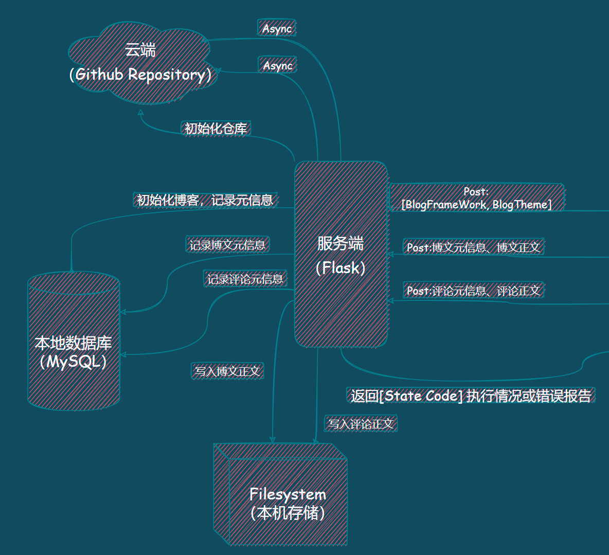

# LabWeek15 - System Implementaion

### > 实验内容：系统的模块设计与编码实现

* > 系统功能结构图
* > 关键模块说明 (流程图、时序图、接口、附注)
* > 实现源代码及运行截图
* > 参考资料gg
  
  * > Steve McConnell, Code Complete, 2nd Edition, O'Reilly 2004
* > Robert C. Martin, Clean Code, Pearson 2008
* > Style Guides for Google-originated Open-source Projects:
  
  * > [https://github.com/google/styleguide](https://github.com/google/styleguide)
* > [https://zh-google-styleguide.readthedocs.io/en/latest/](https://zh-google-styleguide.readthedocs.io/en/latest/)

[飞书链接](https://sysumatrix.feishu.cn/docs/doccnveKp3MOKawCfsK2WhHAMDd#)

[源代码地址](https://github.com/Lanly109/NBlog)

1. ## 系统功能结构图


2. ## 关键模块说明 (流程图、时序图、接口、附注)

### 2.1 前端模块

#### 2.1.1 流程图


#### 2.1.2 时序图


#### 2.1.3 接口


### 2.2 后端

#### 2.2.1 流程图



#### 2.2.2 时序图


#### 2.2.3 接口


3. ### 前后端交互接口约定

#### POST 添加personal key

POST /api/personalkeys

> Body 请求参数

```JSON
{
  "key": "Duis"
}
```

##### 请求参数

| **名称**  | **位置**  | **类型**  | **必选**  | **中文名**  | **说明**                        |
| ------------ | ------------ | ------------ | ------------ | -------------- | ---------------------------------- |
| body       | body       | object     | 否         |              | none                             |
| » key     | body       | string     | 是         | 密钥         | 给后端调用github api时的身份验证 |

> 返回示例

> 成功

```JSON
{
  "code": 200,
  "msg": "ok"
}
```

```JSON
{
  "code": 400,
  "msg": "key invalid"
}
```

##### 返回结果

| **状态码**  | **状态码含义**                                       | **说明**  | **数据模型**  |
| -------------- | ------------------------------------------------------- | ------------ | ---------------- |
| 200          | [OK](https://tools.ietf.org/html/rfc7231#section-6.3.1)  | 成功       | Inline         |

##### 返回数据结构

状态码 **200**

| **名称**  | **类型**  | **必选**  | **约束**  | **说明**  |
| ------------ | ------------ | ------------ | ------------ | ------------ |
| » code    | integer    | true       | none       | none       |
| » msg     | string     | true       | none       | none       |

#### POST 同步仓库与云端

POST /api/sync

> 返回示例

> 成功

```JSON
{
  "code": 200,
  "msg": "ok"
}
```

```JSON
{
  "code": 400,
  "msg": "同步超时，请稍后重试"
}
```

```JSON
{
  "code": 400,
  "msg": "无权限..."
}
```

##### 返回结果

| **状态码**  | **状态码含义**                                       | **说明**  | **数据模型**  |
| -------------- | ------------------------------------------------------- | ------------ | ---------------- |
| 200          | [OK](https://tools.ietf.org/html/rfc7231#section-6.3.1)  | 成功       | Inline         |

##### 返回数据结构

状态码 **200**

| **名称**  | **类型**  | **必选**  | **约束**  | **说明**  |
| ------------ | ------------ | ------------ | ------------ | ------------ |
| » code    | integer    | true       | none       | none       |
| » msg     | string     | true       | none       | none       |

#### GET 获取标号为id的文章内容

GET /api/articals/{id}

##### 请求参数

| **名称**  | **位置**  | **类型**  | **必选**  | **中文名**  | **说明**  |
| ------------ | ------------ | ------------ | ------------ | -------------- | ------------ |
| id         | path       | string     | 是         |              | none       |

> 返回示例

> 成功

```JSON
{
  "code": 200,
  "msg": "ok",
  "data": {
    "id": 6423809820871662,
    "title": "外土算或住代他",
    "abstract": "场子传制度转车到门心团气立流活。",
    "date": "2014-06-29 02:49:58",
    "content": "切当格或话程劳部重消现受音如结太。月气说代期属行利体就成候什好。情况无易九选十导走意家置北但文满验。东开周同许拉真打况住空与话比。东养文连流平报海接便正军放之图。革消后等段立电此类角反史低器压习。",
    "tag": [
      "生",
      "况",
      "则",
      "力",
      "百"
    ],
    "category": "也"
  }
}
```

```JSON
{
  "code": 404,
  "msg": "文章不存在哦",
  "data": {}
}
```

##### 返回结果

| **状态码**  | **状态码含义**                                       | **说明**  | **数据模型**  |
| -------------- | ------------------------------------------------------- | ------------ | ---------------- |
| 200          | [OK](https://tools.ietf.org/html/rfc7231#section-6.3.1)  | 成功       | Inline         |

##### 返回数据结构

状态码 **200**

| **名称**     | **类型**  | **必选**  | **约束**  | **说明**                                  |
| --------------- | ------------ | ------------ | ------------ | -------------------------------------------- |
| » code       | integer    | true       | none       | none                                       |
| » msg        | string     | true       | none       | none                                       |
| » data       | 文章结构   | true       | none       | none                                       |
| »» id       | integer    | true       | none       | 后端生成，用于后续定位获取的是哪个文章内容 |
| »» title    | string     | true       | none       | none                                       |
| »» abstract | string     | true       | none       | none                                       |
| »» date     | string     | true       | none       | none                                       |
| »» content  | string     | true       | none       | none                                       |
| »» tag      | [string]   | true       | none       | none                                       |
| »» category | string     | true       | none       | none                                       |

#### PUT 更新标号为id的文章

PUT /api/articals/{id}

> Body 请求参数

```JSON
{
  "id": 0,
  "title": "string",
  "abstract": "string",
  "date": "string",
  "content": "string",
  "tag": [
    "string"
  ],
  "category": "string"
}
```

##### 请求参数

| **名称**  | **位置**  | **类型**                                                                                                  | **必选**  | **中文名**  | **说明**  |
| ------------ | ------------ | ------------------------------------------------------------------------------------------------------------ | ------------ | -------------- | ------------ |
| id         | path       | string                                                                                                     | 是         |              | none       |
| body       | body       | [%E6%96%87%E7%AB%A0](https://sysumatrix.feishu.cn/docs/doccnveKp3MOKawCfsK2WhHAMDd#schema%E6%96%87%E7%AB%A0)  | 否         | 文章         | none       |

> 返回示例

> 成功

```JSON
{
  "code": 200,
  "msg": "更新成功"
}
```

```JSON
{
  "code": 400,
  "msg": "更新失败了，一定是哪里出错了"
}
```

##### 返回结果

| **状态码**  | **状态码含义**                                       | **说明**  | **数据模型**  |
| -------------- | ------------------------------------------------------- | ------------ | ---------------- |
| 200          | [OK](https://tools.ietf.org/html/rfc7231#section-6.3.1)  | 成功       | Inline         |

##### 返回数据结构

状态码 **200**

| **名称**  | **类型**  | **必选**  | **约束**  | **说明**  |
| ------------ | ------------ | ------------ | ------------ | ------------ |
| » code    | integer    | true       | none       | none       |
| » msg     | string     | true       | none       | none       |

#### DELETE 删除标号为id的文章

DELETE /api/articals/{id}

##### 请求参数

| **名称**  | **位置**  | **类型**  | **必选**  | **中文名**  | **说明**  |
| ------------ | ------------ | ------------ | ------------ | -------------- | ------------ |
| id         | path       | string     | 是         |              | none       |

> 返回示例

> 成功

```JSON
{
  "code": 200,
  "msg": "删除成功"
}
```

```JSON
{
  "code": 400,
  "msg": "要删除的文章不存在哦"
}
```

```JSON
{
  "code": 400,
  "msg": "删除出错啦（这是后端给出的错误）"
}
```

##### 返回结果

| **状态码**  | **状态码含义**                                       | **说明**  | **数据模型**  |
| -------------- | ------------------------------------------------------- | ------------ | ---------------- |
| 200          | [OK](https://tools.ietf.org/html/rfc7231#section-6.3.1)  | 成功       | Inline         |

##### 返回数据结构

状态码 **200**

| **名称**  | **类型**  | **必选**  | **约束**  | **说明**  |
| ------------ | ------------ | ------------ | ------------ | ------------ |
| » code    | integer    | true       | none       | none       |
| » msg     | string     | true       | none       | none       |

#### GET 获取文章列表

GET /api/articals

> 返回示例

> 成功

```JSON
{
  "code": 200,
  "msg": "ok",
  "data": [
    {
      "id": 6258449560446842,
      "title": "交强直难研法样",
      "abstract": "标方市群须也重论走亲等养放教受团加。",
      "date": "1995-08-01 03:39:32",
      "tag": [
        "头",
        "增",
        "许",
        "办"
      ],
      "category": "太"
    },
    {
      "id": 3986142246168690,
      "title": "几那每方",
      "abstract": "斯步来百派市及复属省质议经事对。",
      "date": "2008-06-09 17:07:30",
      "tag": [
        "观",
        "很",
        "品"
      ],
      "category": "持"
    }
  ]
}
```

```JSON
{
  "code": 400,
  "msg": "还没有文章哦",
  "data": []
}
```

##### 返回结果

| **状态码**  | **状态码含义**                                       | **说明**  | **数据模型**  |
| -------------- | ------------------------------------------------------- | ------------ | ---------------- |
| 200          | [OK](https://tools.ietf.org/html/rfc7231#section-6.3.1)  | 成功       | Inline         |

##### 返回数据结构

状态码 **200**

| **名称**     | **类型**  | **必选**  | **约束**  | **说明**                                  |
| --------------- | ------------ | ------------ | ------------ | -------------------------------------------- |
| » code       | integer    | true       | none       | none                                       |
| » msg        | string     | true       | none       | none                                       |
| » data       | [object]   | true       | none       | none                                       |
| »» id       | integer    | true       | none       | 后端生成，用于后续定位获取的是哪个文章内容 |
| »» title    | string     | true       | none       | none                                       |
| »» abstract | string     | true       | none       | none                                       |
| »» date     | string     | true       | none       | none                                       |
| »» tag      | [string]   | true       | none       | none                                       |
| »» category | string     | true       | none       | none                                       |

#### POST 新增文章

POST /api/articals

> Body 请求参数

```JSON
{
  "id": 0,
  "title": "string",
  "abstract": "string",
  "date": "string",
  "content": "string",
  "tag": [
    "string"
  ],
  "category": "string"
}
```

##### 请求参数

| **名称**  | **位置**  | **类型**  | **必选**  | **中文名**  | **说明**  |
| ------------ | ------------ | ------------ | ------------ | -------------- | ------------ |
| body       | body       | 文章结构   | 否         | 文章         | none       |

> 返回示例

> 成功

```JSON
{
  "code": 200,
  "msg": "创建成功"
}
```

```JSON
{
  "code": 400,
  "msg": "创建失败辣！（重名、权限等其他原因）"
}
```

##### 返回结果

| **状态码**  | **状态码含义**                                       | **说明**  | **数据模型**  |
| -------------- | ------------------------------------------------------- | ------------ | ---------------- |
| 200          | [OK](https://tools.ietf.org/html/rfc7231#section-6.3.1)  | 成功       | Inline         |

##### 返回数据结构

状态码 **200**

| **名称**  | **类型**  | **必选**  | **约束**  | **说明**  |
| ------------ | ------------ | ------------ | ------------ | ------------ |
| » code    | integer    | true       | none       | none       |
| » msg     | string     | true       | none       | none       |

#### POST 初始化仓库

POST /api/init

> Body 请求参数

```JSON
{
  "path": "/xmxc/084038",
  "create": true
}
```

##### 请求参数

| **名称**  | **位置**  | **类型**  | **必选**  | **中文名**    | **说明**          |
| ------------ | ------------ | ------------ | ------------ | ---------------- | -------------------- |
| body       | body       | object     | 否         |                | none               |
| » path    | body       | string     | 是         | 路径           | 仓库存放的绝对路径 |
| » create  | body       | boolean    | 是         | 是否为创建博客 | none               |

> 返回示例

> 成功

```JSON
{
  "code": 200,
  "msg": "ok"
}
```

```JSON
{
  "code": 400,
  "msg": "permission deny"
}
```

##### 返回结果

| **状态码**  | **状态码含义**                                       | **说明**  | **数据模型**  |
| -------------- | ------------------------------------------------------- | ------------ | ---------------- |
| 200          | [OK](https://tools.ietf.org/html/rfc7231#section-6.3.1)  | 成功       | Inline         |

##### 返回数据结构

状态码 **200**

| **名称**  | **类型**  | **必选**  | **约束**  | **说明**  |
| ------------ | ------------ | ------------ | ------------ | ------------ |
| » code    | integer    | true       | none       | none       |
| » msg     | string     | true       | none       | none       |

#### 数据模型

##### 文章

```JSON
{
  "id": 0,
  "title": "string",
  "abstract": "string",
  "date": "string",
  "content": "string",
  "tag": [
    "string"
  ],
  "category": "string"
}
```

###### 属性

| **名称**  | **类型**  | **必选**  | **约束**  | **说明**                                  |
| ------------ | ------------ | ------------ | ------------ | -------------------------------------------- |
| id         | integer    | true       | none       | 后端生成，用于后续定位获取的是哪个文章内容 |
| title      | string     | true       | none       | none                                       |
| abstract   | string     | true       | none       | none                                       |
| date       | string     | true       | none       | none                                       |
| content    | string     | true       | none       | none                                       |
| tag        | [string]   | true       | none       | none                                       |
| category   | string     | true       | none       | none                                       |

##### 请求成功

```JSON
{
  "code": 0,
  "msg": "string",
  "data": "string"
}
```

###### 属性

| **名称**  | **类型**  | **必选**  | **约束**  | **说明**  |
| ------------ | ------------ | ------------ | ------------ | ------------ |
| code       | integer    | true       | none       | none       |
| msg        | string     | true       | none       | none       |
| data       | string     | true       | none       | none       |

## 实现源代码及运行截图
