# LabWeek18 - Submitting the System Testing 

# 1. 引言

## 1.1 编写目的

本测试文档的编写目的为对被测试项目NBlog的测试过程进行记录和总结，并针对测试结果给出建议。以方便后续开发人员对整个项目的使用指南和理解，同时让可能存在的投资方了解产品详细的设计与实现过程。本文档的预期读者是NBlog的开发人员、运维人员和审查者。

## 1.2 背景

### 1.2.1 被测试产品简介

 被测试产品名称为NBlog, 意在帮助小白搭建个人博客， 对于小白极度友好，将实现一键搭建博客的功能，实现自己的个性化博客搭建。不同于花里胡哨的博客网站，本软件完全基于本地环境不进行数据的上传，强有力的保护了用户的隐私。另外，本软件可以开源并鼓励开发者社区开发相关插件，将建立一个良好的开发生态。

本产品技术上的运行支持平台为 Windows, 博客搭建工具为 Hexo & Hugo & Vuepress, 前端界面由 electron 搭建。

### 1.2.2 测试环境说明

本次测试环境与实际用户使用环境有以下主要区别

- 测试环境的软件使用者为对软件完全了解的开发者本身，而实际使用者为一无所知的小白，可能有某些操作无法完全模仿

- 测试环境的测试宿主机仅为开发者所能找到的Windows、Linux、Mac三平台的三台机器，实际场景可能出现未考虑到的机型

## 1.3 定义

**用户**：使用NBlog搭建博客并管理博客的用户群体

**博客框架**：用户所选用的博客主体框架，如Hexo、Hugo

**博文**：用户创建、编辑并管理的博文文本及元信息

**评论**：第三者对用户博文添加的评论文本及元信息

**云端仓库**：持久化于云端的存放博客的仓库，如Github

**用户帐号**：在应用信息系统中设置与保存、用于授予用户合法登陆和使用应用信息系统等权限的用户信息，包括用户名、密码以及用户真实姓名、单位、联系方式等基本信息内容。

## 1.4 参考资料

- 《NBlog开题报告》

- 《NBlog可行性分析报告》

- 《NBlog需求规格说明书》

- IEEE 1016-2009 - IEEE Standard for Information Technology--Systems Design--Software Design Descriptions

# 2. 测试概要

### 2.1 系统简介

本系统名称为NBlog, 意在帮助小白搭建个人博客， 对于小白极度友好，将实现一键搭建博客的功能，实现自己的个性化博客搭建。不同于花里胡哨的博客网站，本软件完全基于本地环境不进行数据的上传，强有力的保护了用户的隐私。另外，本软件可以开源并鼓励开发者社区开发相关插件，将建立一个良好的开发生态。

### 2.2 测试计划描述

本测试报告按照NBlog的项目需求说明书中介绍的功能，测试系统的能力是否满足《NBlog需求规格说明书》的功能和性能需求。测试分为功能测试和系统测试两部分。

功能测试覆盖子系统中的功能模块，本测试针对现有产品功能模块以及实施结果分别进行测试，测试整个系统是否达到需求规格说明书中要求的功能，以及测试系统的易用性、用户界面的友好性。

系统测试包括系统的易用性、可靠性、安全性、可维护性进行测试，整个系统集成后提供服务的能力，还包括系统服务性能测试、疲劳测试。

### 2.3 测试环境

|序号|用途|硬件环境|软件环境|
|:---:|---|---|---|
|1|客户端|CPU：Intel i5-8265U； 内存 DDR4 32GB；磁盘：SSD固态硬盘|操作系统：Windows|
|2|客户端|CPU: AMD 锐龙R7 5800H；内存：16GB；磁盘：SSD固态硬盘|操作系统：Windows|
|3|客户端|CPU：Apple M1；内存：16GB；磁盘：SSD固态硬盘|操作系统：Mac|
|4|客户端|CPU：Intel i5-8265U； 内存 DDR4 32GB；磁盘：SSD固态硬盘|操作系统：Linux|
|5|客户端|CPU: AMD 锐龙R7 5800H；内存：16GB；磁盘：SSD固态硬盘|操作系统：Linux|

# 3. 测试结果及发现

## 3.1 测试1（创建仓库）

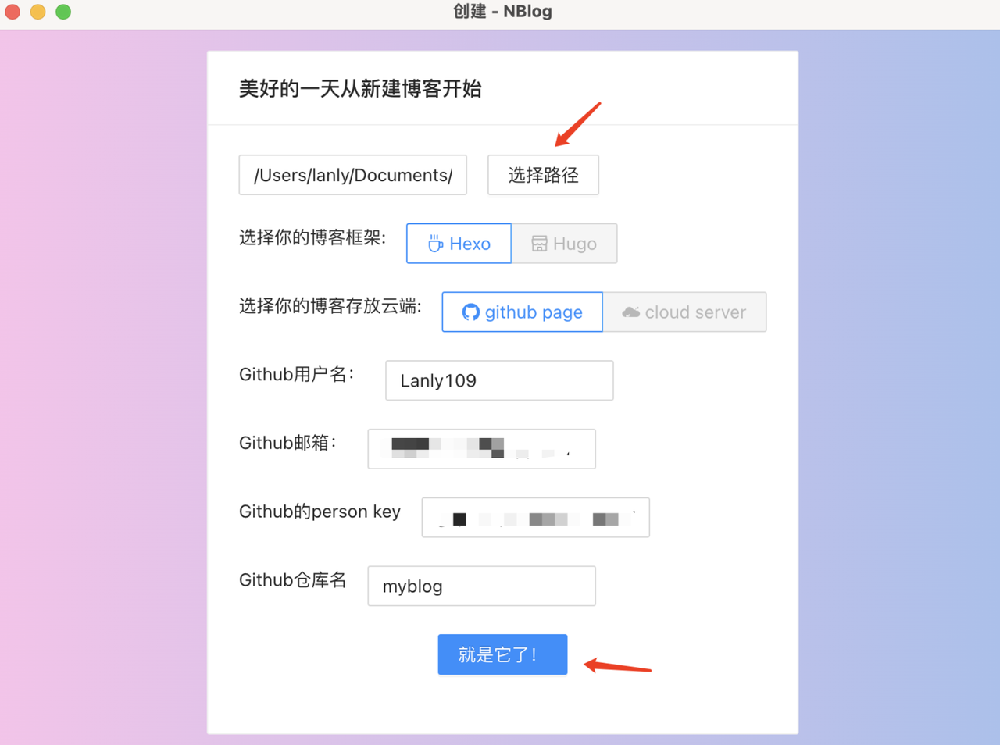

创建成功， 会弹出通知提示用户。这个时候会有一个默认的文章 Hello World， 并且上栏也有本地仓库和远程仓库的配置信息。 

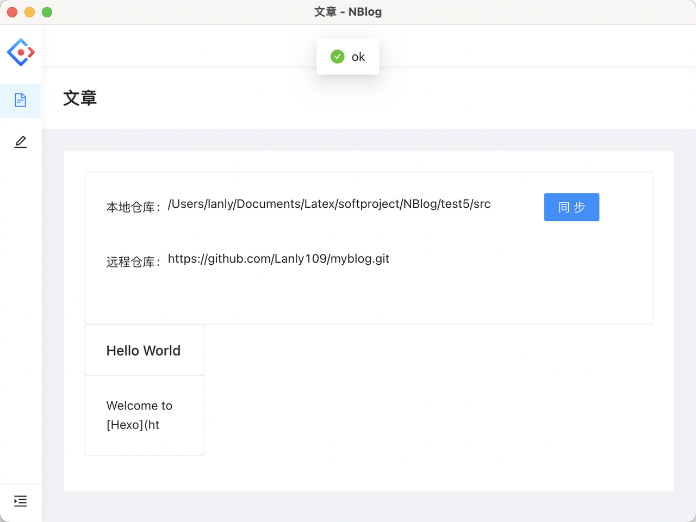

通过观察本地的动态数据输出， 可以看到相应的配置信息已经被保存到了本地文件中。

从输出结果上看，测试成功。

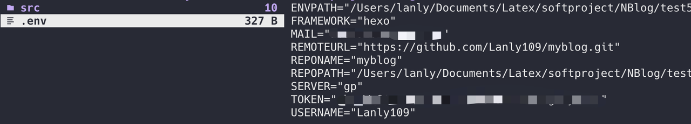

## 3.2 测试2（选择仓库）

本软件支持在本地创建多个仓库，在软件入口处可以进行本地仓库的选择。

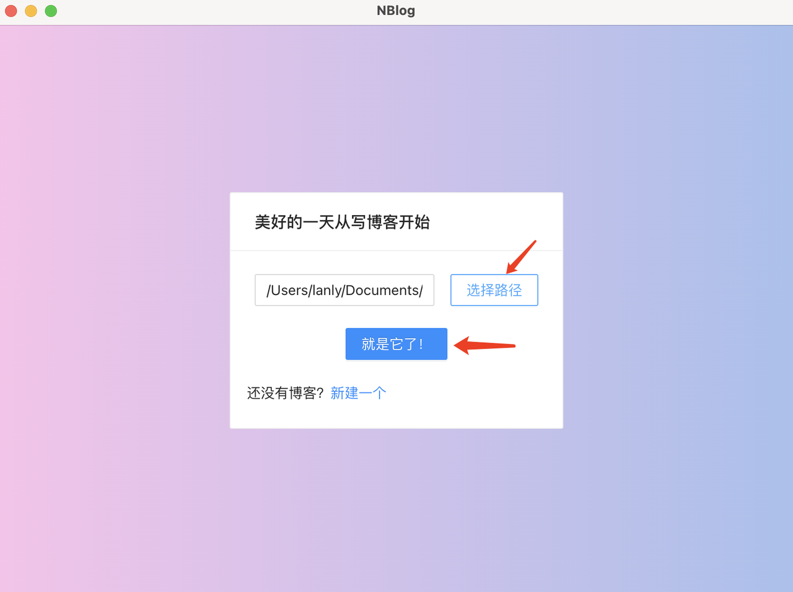

进入仓库成功， 会弹出通知提示用户。查看相应配置信息，和自己选择的仓库相匹配。

同时查看相应的文章，和自己在该仓库中创建的文章相匹配。

从输出结果上看，测试成功。

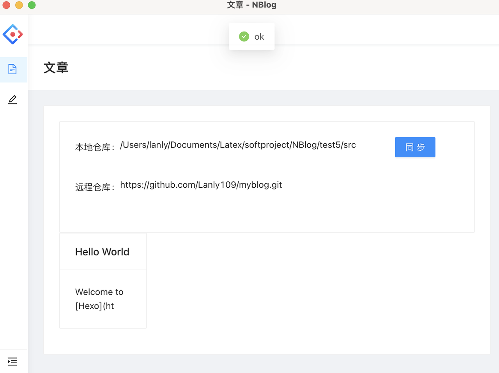

## 3.3 测试3（发表文章）

可以在发表文章界面进行发表文章的操作。发表文章时，需要输入题目，类别和标签（不允许为空）。然后点击发表即可进行发表。

发表文章成功会出现相应的提示。同时在文章管理主页中会出现相应的文章。

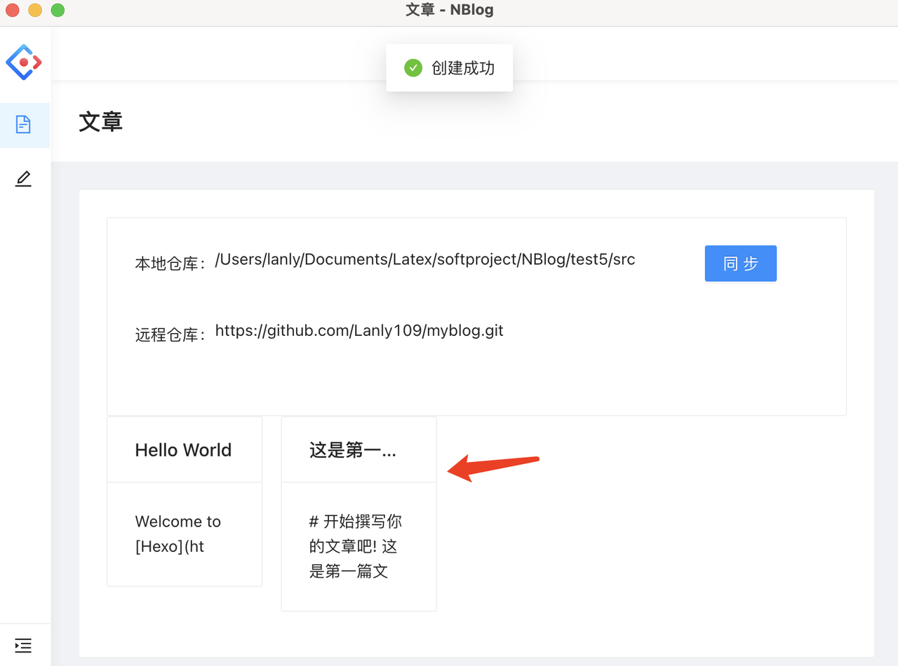

从输出结果上看，测试成功。

## 3.4 测试4（更新文章）

可以在主页选择相对应的文章并进入进行更新。

通过新增内容然后进行更新，如下所示。

在部署的网站上可以看到相应内容已经进行更新了。 

从输出结果上看，测试成功。

## 3.5 测试5（删除文章）

除了更新文章以外，还可以删除文章。

点击红色删除按钮即可删除文章。

## 3.6 测试6（同步仓库）

由于发表和更新都是本地的操作， 尚未同步云端远程仓库。所以可以在文章管理主页点击同步按钮进行同步操作。

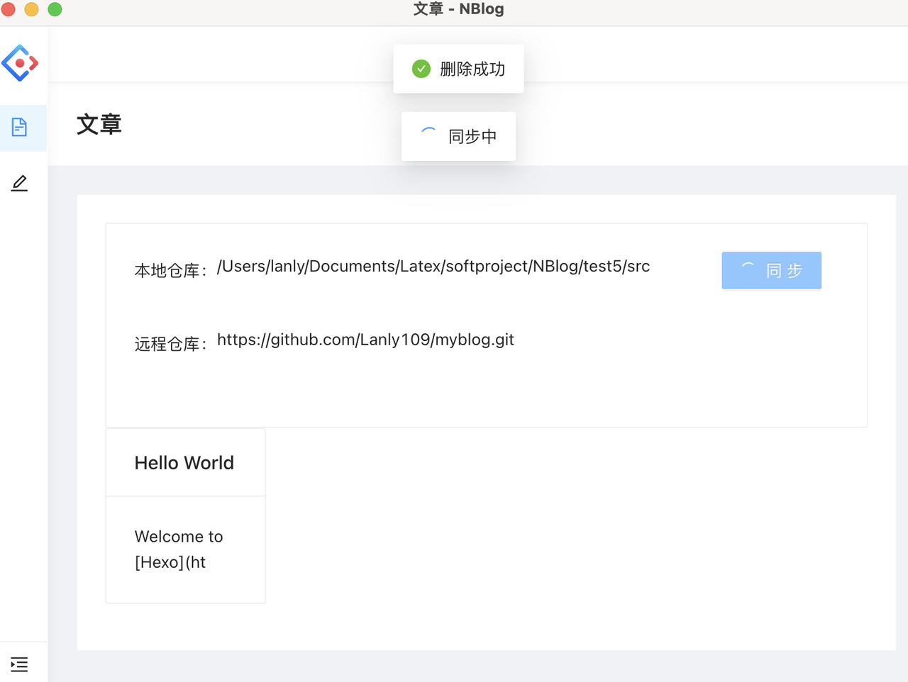

同步后查看云端仓库，可以看见已经有相应的 commit 操作，成功同步到云端。

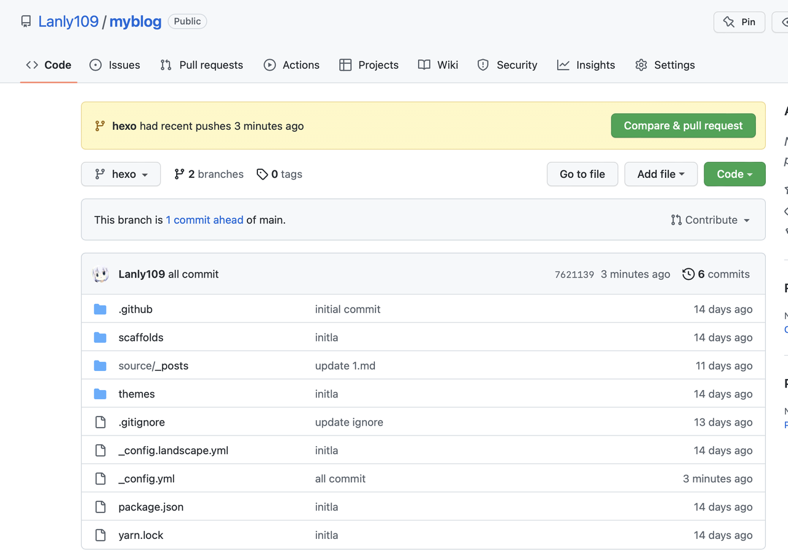

github action 已经在构建中。

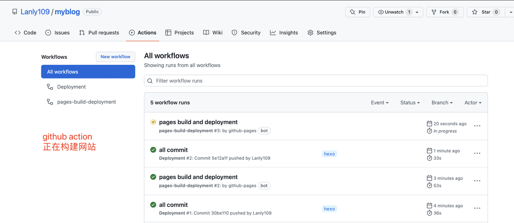

查看部署的网站， 可以看到文章已删除。与预期结果相一致。

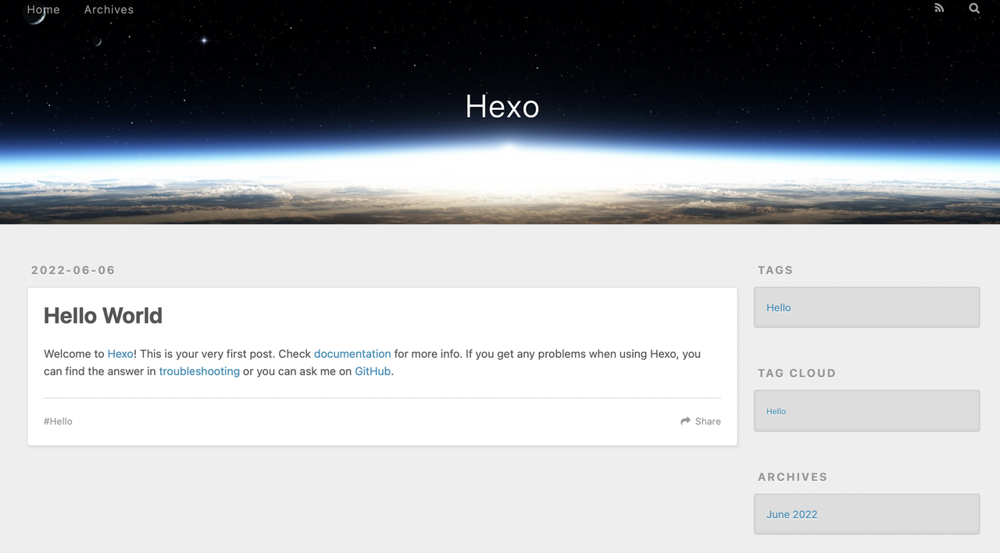

从输出结果上看，测试成功。

## 3.7 测试7（题目类别或者标签为空不能发表或更新）

这里针对发表或者更新文章时的异常进行处理。

题目类别或者标签有一个为空的时候将不能够发表或更新文章，会弹出相应的通知来提醒用户。

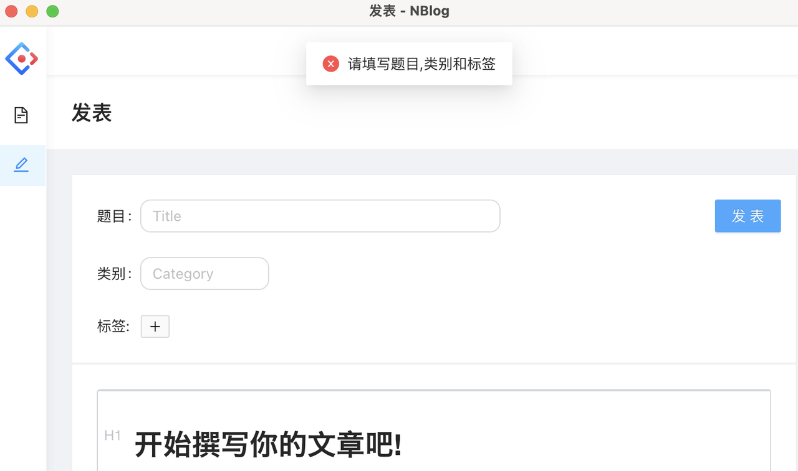

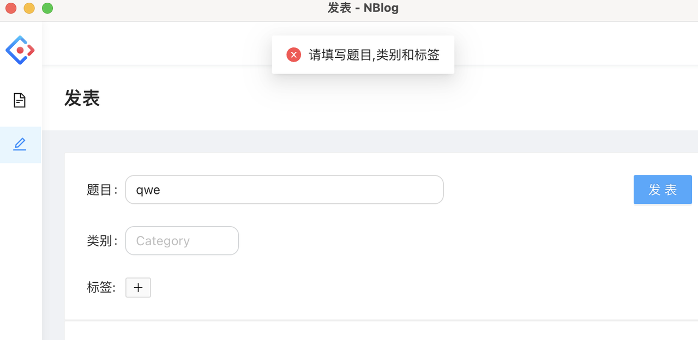

从输出结果上看，测试成功。

# 4. 对软件功能的结论

## 4.1 功能1（一键部署博客）

### 4.1.1 能力

在创建博客页面，用户仅需输入github用户名、博客框架、邮箱、仓库名、个人token等构建必须的信息，该软件就可以帮助用户创建仓库、初始化本地文件、文件推送、开启github action构建博客网页文件、开启github pages，显示构建后的网页内容，而无需用户额外的操作，使得用户可以专注于博文的编写，而无需了解网站搭建时的各种原理、工具和知识。

### 4.1.2 限制

由于众所周知的原因，github在国内访问不佳，在创建时可能会遇到网络不通畅的情况导致创建失败，只能尝试重复创建或者使用膜法。

## 4.2 功能2（博文的管理）

### 4.2.1 能力

主界面能够显示用户所编写的博文内容，并支持对文章贴上标签、归档，简化用户对博文的操作。在hexo中对文章标签、归档的属性有着独特的标识法，而用户无需了解这个就可以对博文进行标记。

### 4.2.2 限制

在博文管理界面尚未能够实现对图片的呈现操作，用户需要点击打开相对应的文章才能够查看文章中包含的图片。

## 4.3 功能3（减少依赖的安装）

### 4.3.1 能力

众所周知，对博客的创建需要安装npm、hexo等依赖，为了上传到github又需要安装git等插件，但该软件实现了只需安装该软件就可以实现对博客的创建、部署和博文的编写。减少了系统依赖的安装，使得系统更加迅速、安全，可控。

### 4.3.2 限制

无

# 5. 分析摘要

## 5.1 能力

被测试项目NBlog在测试报告撰写时已能达到交付标准。NBlog能够实现用户需求说明书上的诸如博客框架创建、博文增删改查、云端部署等功能，且实现了Linux、Windows、Mac三平台的发行使用，且测试结果均正常。

## 5.2 缺陷和限制

- 测试过程中，测试环境的软件使用者为对软件完全了解的开发者本身，而实际使用者为一无所知的小白，可能有某些操作无法完全模仿。

- 测试过程中，测试环境的测试宿主机仅为开发者所能找到的Windows、Linux、Mac三平台的三台机器，实际场景可能出现未考虑到的机型

## 5.3 建议

- 对测试过程出现的异常进行根因定位

- 对测试过程排查出的bug进行修复

- 对在测试过程中发现的可以改进的功能进行完善

## 5.4 评价

该软件已经具有较为完善的功能，能够交付用户进行使用。具体来说，NBlog 实现了创建博客，发表文章，更新文章，删除文章，管理文章题目类别和标签的功能，充分满足了用户需求。

目前已经在 github 上发布 release，项目地址为 https://github.com/Lanly109/NBlog。

# 6. 测试资源消耗

## 6.1 人力消耗

- 测试参与人员：3

- 测试时间：6h

## 6.2 资源消耗

- PC*3
